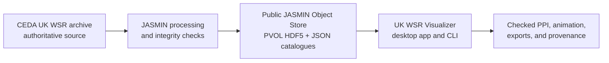

<p align="center">
  
</p>

<h1 align="center">UK WSR Visualizer</h1>

<p align="center">
  <strong>Find, inspect, compare, and export UK weather-surveillance radar volumes.</strong><br>
  A local desktop viewer and Python toolkit for traceable first-look access to the UK WSR archive.
</p>

<p align="center">
  <a href="https://rrniii.github.io/uk-wsr-visualizer/"></a>
  <a href="https://github.com/rrniii/uk-wsr-visualizer/actions/workflows/docs.yml"></a>
  <a href="LICENSE"></a>
  <a href="CITATION.cff"></a>
</p>

## From archive to evidence

UK WSR Visualizer makes a UK weather-radar volume usable before a specialist
processing environment is required. It discovers data through small, lazy
catalogue requests; retrieves only the selected HDF5 volume; renders a
georeferenced PPI; and retains the source and display choices needed to revisit
or cite the result.

It is designed for researchers, students, operational collaborators, educators,
and data-service teams who need to answer a first question quickly and
responsibly: *what is in this radar volume, and is it suitable for the next
stage of analysis?*

> UK WSR Visualizer is a first-look and evidence-export layer. It complements,
> rather than replaces, analysis in tools such as Py-ART, wradlib, vol2bird, or
> local scientific workflows.



## Why it matters

The final published PVOL catalogue currently provides direct, lazy discovery of:

| | Published collection |
|---|---:|
| Radar sites | **17** |
| Radar-days | **58,307** |
| Per-volume PVOL files | **23,505,937** |
| Data represented | **132.1 TB** |
| Indexed dates | **2013-01-21 to 2026-07-14** |

The app does **not** download a day, a year, or the whole collection to show
one scan. It reads a root catalogue, a selected radar-year coverage record, and
a selected day record, then caches only the chosen PVOL HDF5 file locally.
This keeps access practical while preserving direct links back to the published
source object.

## What you can do

| Discover | Inspect | Compare and share |
|---|---|---|
| Search by date, radar, pulse, time, field, and elevation. | Render map-based PPIs with range rings, mouse zoom/pan, palettes, display limits, and click readouts. | Animate a sequence, compare four panels, export a figure or source object, and keep a provenance manifest. |
| Read lightweight JSON catalogues before downloading data. | Switch between long- and short-pulse volumes without treating them as interchangeable. | Record radar, UTC time, pulse, field, elevation, source URL, display settings, QC settings, and software version. |

The desktop applications run in their own windows on macOS, Windows, and Linux.
The same Python package exposes the catalogue, rendering, export, and
object-store workflows to command-line and API users.

## Quick start

### Use the desktop application

Download the current platform build from the project’s beta distribution route,
extract it if required, and open **UK WSR Visualizer**. The application starts
with the public catalogue and maintains a bounded local cache. Choose a date,
radar, pulse, field, time, and elevation; then inspect the PPI before exporting
or comparing further scans.

Detailed platform instructions are in the
[installation guide](docs/user_guide/installation.md).

### Use the Python toolkit

```bash
git clone git@github.com:rrniii/uk-wsr-qc.git
git clone git@github.com:rrniii/uk-wsr-visualizer.git
cd uk-wsr-visualizer
python -m venv .venv
. .venv/bin/activate
pip install -e ../uk-wsr-qc
pip install -e ".[dev]"
uk-wsr-visualizer api
```

Open `http://127.0.0.1:8000` to use the local viewer. For a complete example,
see the [quick start](docs/user_guide/quickstart.md).

## A traceable access path

The project follows a deliberate publication model:

1. **CEDA remains authoritative.** UK weather-surveillance radar source data
   are read from the archive without modifying them.
2. **JASMIN builds access products.** Daily aggregates are verified and
   represented as per-volume ODIM PVOL HDF5 files with a versioned catalogue.
3. **The Object Store serves public discovery and selected objects.** The root
   catalogue is published only after its referenced objects and child
   catalogues are available.
4. **The desktop client reads lazily.** Catalogues answer what exists; the
   selected object answers what the chosen volume contains.
5. **Exports preserve context.** Manifests record the source object, selection,
   display/processing settings, software version, and citation guidance.

This is intended to make a first figure or case selection reviewable, not just
visually appealing.

## Documentation

| Resource | Purpose |
|---|---|
| [Documentation site](https://rrniii.github.io/uk-wsr-visualizer/) | User guide, examples, API reference, and developer guidance. |
| [Install and use](docs/install_and_use.md) | Desktop app, local server, cache, and source-data guidance. |
| [Catalogues](docs/user_guide/catalogs.md) | How lazy root, coverage, and day catalogues work. |
| [Viewer guide](docs/user_guide/viewer.md) | PPI interpretation, controls, comparison, and exports. |
| [Object Store setup](docs/jasmin_object_store_setup.md) | Publication and operational workflow. |
| [Release notes](docs/release_notes.md) | Changes in each software release. |

Build the documentation locally:

```bash
pip install -e ".[docs]"
sphinx-build -b html docs docs/_build/html
```

## Scope and scientific use

UK WSR Visualizer displays what is encoded in the selected radar volume. Radar
geometry, beam height, pulse configuration, missing sectors, range effects,
clutter, and quality limitations remain part of interpretation. Compare panels
with controlled labels and physical scales, and treat an unexpected pattern as a
diagnostic to investigate rather than an automatic scientific conclusion.

The optional display and QC controls are reproducible visual/processing choices;
they do not overwrite source HDF5 files. Exported manifests preserve those
choices so results can be checked or repeated.

The scientific mask implementation, model registry, validation tools, and QC
evidence are maintained separately in
[UK WSR QC](https://github.com/rrniii/uk-wsr-qc). The visualizer consumes its
versioned Python package and contains only the desktop integration.

## Citation and acknowledgement

When UK WSR Visualizer contributes to a figure, case selection, export, or
research result, cite:

1. the exact archived software release;
2. the associated Weather article when available;
3. the formal source-data citation for the UK WSR data used; and
4. JASMIN, where JASMIN storage or compute supported the work.

Run `uk-wsr-visualizer-citation --json` for machine-readable provenance, or
open [CITATION.md](CITATION.md) for the current guidance. DOI placeholders will
be replaced after the first archived release and article publication.

## Development

The project welcomes reproducible bug reports, documentation improvements, and
contributions that preserve the source-data and provenance contract. See the
[developer guide](docs/developer_guide/index.md) and
[contributing notes](docs/developer_guide/contributing.md).

UK WSR Visualizer is an independent open-source implementation. It is not an
official data service and does not replace the relevant source-data access terms
or formal citation requirements.
