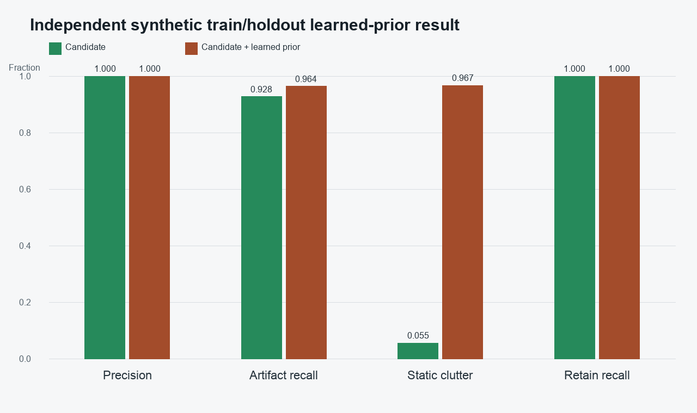
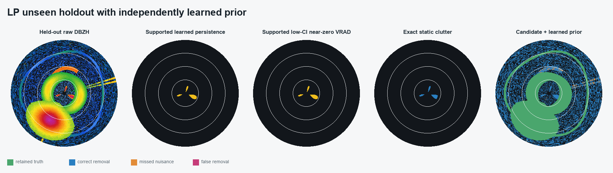
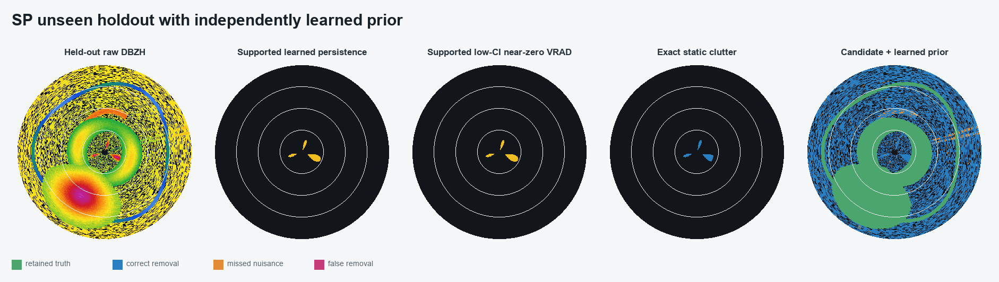

# UK WSR learned-prior synthetic train/holdout validation

Status: **validation gates passed; not eligible for promotion**

The learned map is trained on moving weather, biological, clear-air, AP, and
interference scenes. Only static clutter remains fixed. Holdout seeds are
disjoint from training, so the result cannot be obtained by memorising the
retained-signal geometry.

| Method | Precision | Artifact recall | Static-clutter recall | Retain recall |
| --- | ---: | ---: | ---: | ---: |
| Candidate without learned prior | 1.0000 | 0.9278 | 0.0549 | 1.0000 |
| Candidate + CI-conditioned learned prior | 1.0000 | 0.9640 | 0.9671 | 1.0000 |

The learned prior changes static-clutter recall by
`+0.9122`. The statistic is near-zero VRAD
frequency conditioned on low CI, preventing atmospheric crossings from
diluting the learned stationary-clutter evidence.







## Promotion blockers

- independent real-data annotations are not complete
- real multi-date models are not yet benchmarked
- desktop and iOS learned-prior parity is not yet proven

## Reproduction

```bash
PYTHONPATH=src .venv/bin/python tools/validate_qc_learned_synthetic.py   --output-dir reports/qc_synthetic_learned_v1
```
