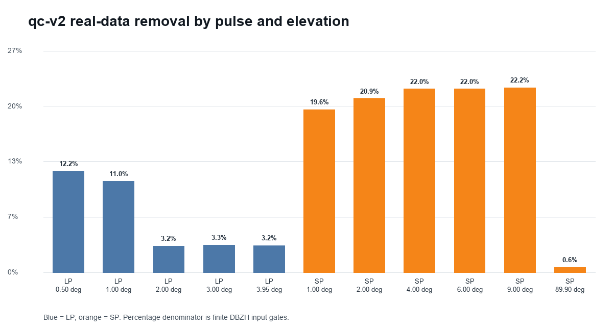
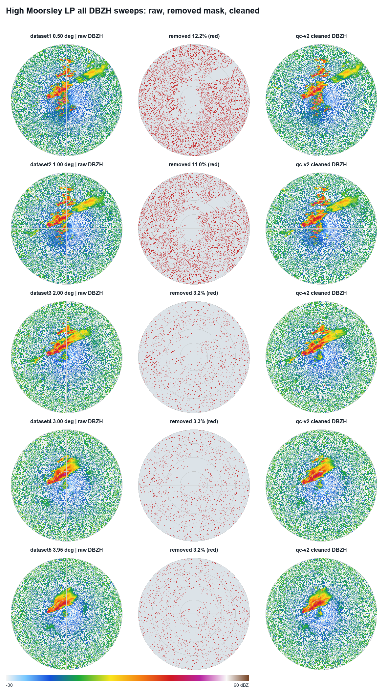
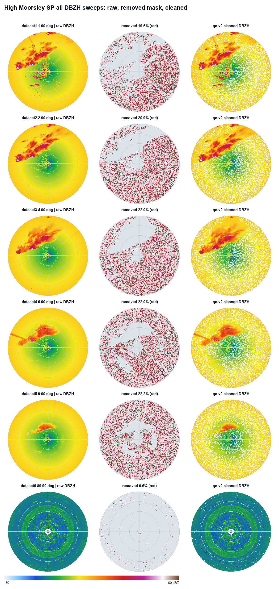
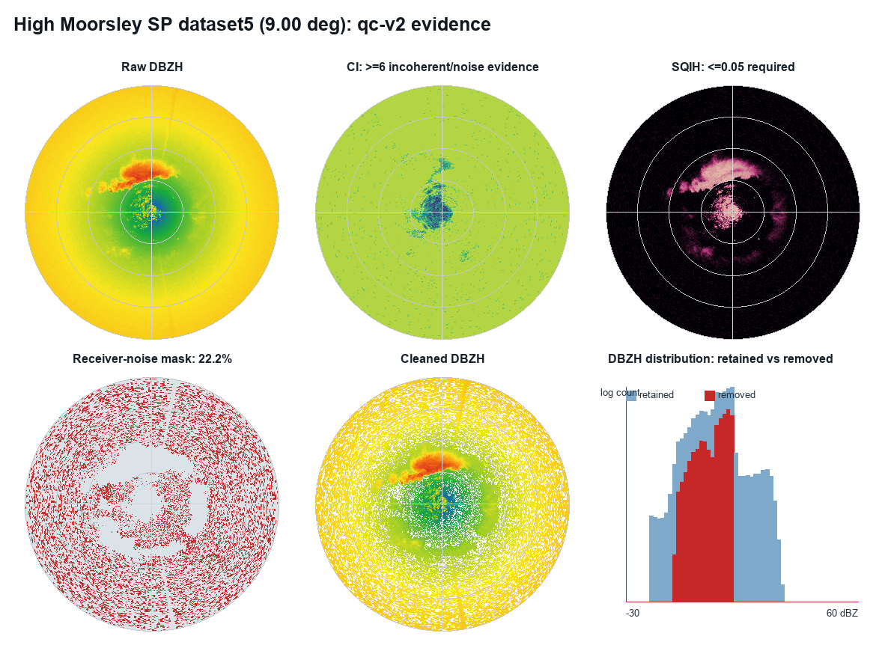

# Noise and Background Subtraction Results

Status date: 2026-07-16

This report records the current measured behaviour of the UK WSR `qc-v2`
noise and clutter removal system. It covers the shared Python/desktop path, the
native iOS implementation, synthetic tests, and a real two-pulse, all-elevation
validation case. The processing contract is documented separately in
[UKMO WSR Processing Pipeline](ukmo_wsr_processing_pipeline.md).

## Result

The over-removing default has been replaced. The normal app mode no longer
deletes a gate because it is weak, isolated, low-RHOHV, low-SQI, near-zero
velocity, or present in a one-day learned map. It removes only:

1. **Receiver noise** supported by a near-floor reflectivity value, high CI,
   very low SQI, and at least three independent bad-moment indicators.
2. **Learned persistent clutter** only when the model was trained across enough
   dates and the learned gate is confirmed by low current CI and near-zero
   current radial velocity.

Weather, biological scatter, and any other unknown signal are treated alike:
they remain unless the evidence identifies the gate as nuisance noise or
clutter. This is not a weather/biology classifier.

The real High Moorsley validation produced the following aggregate result:

| Measure | Result |
| --- | ---: |
| PVOL files | `2` (`lp` and `sp`) |
| DBZH sweeps | `11` |
| Finite input gates | `1,162,800` |
| Retained gates | `1,039,713` |
| Removed gates | `123,087` (`10.59%`) |
| Receiver-noise removals | `123,087` |
| Learned-background removals | `0` |
| Removed gates at or above 20 dBZ | `0` |
| Mask version | `qc-v2` |



## Why `qc-v1` Over-Removed

The previous app default combined four broad deletion paths:

- local DBZH texture/speckle;
- generic companion-field quality scoring;
- standalone near-zero-velocity static-clutter detection;
- learned maps trained on 50 scans from one day.

Those rules were useful diagnostics, but they were not sufficiently specific
for deletion. Weak precipitation and biological echoes can be textured, have
low RHOHV, low SQI, or near-zero radial velocity. A one-day map can also learn
the weather or biological scene occurring during training. The 96-97% removal
shown in the regression screenshots was therefore a classification failure,
not an acceptable cleanup strength.

`qc-v2` keeps the old rules available in explicit diagnostic modes, but removes
them from the normal and strong app presets.

## Real PVOL Validation

The regression validation uses High Moorsley on 2026-07-11 at 15:00 UTC. Both
PVOL files were decoded from HDF5 and every DBZH elevation was processed with
the same default configuration used by the apps.

| Pulse | Dataset | Elevation | Finite gates | Removed | Removed share | Maximum removed DBZH | Gates >=20 dBZ removed |
| --- | --- | ---: | ---: | ---: | ---: | ---: | ---: |
| LP | `dataset1` | 0.50 deg | 153,000 | 18,608 | 12.16% | -10.2 dBZ | 0 |
| LP | `dataset2` | 1.00 deg | 153,000 | 16,761 | 10.95% | -10.7 dBZ | 0 |
| LP | `dataset3` | 2.00 deg | 153,000 | 4,820 | 3.15% | -9.0 dBZ | 0 |
| LP | `dataset4` | 3.00 deg | 153,000 | 5,050 | 3.30% | -9.4 dBZ | 0 |
| LP | `dataset5` | 3.95 deg | 153,000 | 4,933 | 3.22% | -9.8 dBZ | 0 |
| SP | `dataset1` | 1.00 deg | 68,040 | 13,305 | 19.55% | 11.9 dBZ | 0 |
| SP | `dataset2` | 2.00 deg | 68,040 | 14,192 | 20.86% | 11.8 dBZ | 0 |
| SP | `dataset3` | 4.00 deg | 68,040 | 14,987 | 22.03% | 11.7 dBZ | 0 |
| SP | `dataset4` | 6.00 deg | 68,040 | 14,989 | 22.03% | 11.6 dBZ | 0 |
| SP | `dataset5` | 9.00 deg | 68,040 | 15,078 | 22.16% | 11.5 dBZ | 0 |
| SP | `dataset6` | 89.90 deg | 57,600 | 364 | 0.63% | -8.1 dBZ | 0 |

Across LP, the filter removed 50,172 of 765,000 gates (6.56%). Every LP gate at
or above 0 dBZ was retained. Across SP, it removed 72,915 of 397,800 gates
(18.33%). All SP gates at or above 20 dBZ were retained; the highest removed SP
value was 11.9 dBZ and lies in the short-pulse noise pedestal visible across
the scan.

The plots below show raw DBZH, the exact gate mask, and cleaned DBZH at every
elevation. The precipitation structure remains present through the elevation
sequence. The mask is concentrated in incoherent background gates rather than
the coherent weather echo.





## Evidence Used

The reader now auto-gathers data and quality groups from the selected ODIM
dataset. The High Moorsley files supplied:

`CI`, `DBZH`, `PHIDP`, `RHOHV`, `SQIH`, `VRADH`, `ZDR`,
`LONG_RANGE_NOISE_DBC_H`, and `LONG_RANGE_NOISE_DBC_V`; LP also supplied
`WRADH`.

The receiver-noise rule requires all of the following:

| Evidence | Normal default |
| --- | ---: |
| Current DBZH | At or below estimated range profile + 0.25 dB |
| CI | At least 6 |
| SQI | At most 0.05 |
| Independent bad moments | At least 3 |

The independent bad-moment indicators are PHIDP texture at least 60 degrees,
velocity texture at least 18 m/s, RHOHV at most 0.20, ZDR outside -3 to 8 dB,
or a per-ray long-range noise value at least 3 dB above that scan's median.
Missing fields do not count as evidence. If the required evidence is absent,
the filter fails open and retains the gate.



### Meaning of the UKMO noise fields

- **CI** is useful evidence, but not a target label. Low values (nominally 0-2)
  indicate stable/coherent returns and can support clutter identification. High
  values (nominally 6-7) indicate incoherence and can support receiver-noise
  identification, but may also occur in real atmospheric or biological echoes.
  `qc-v2` never deletes from CI alone.
- **`LONG_RANGE_NOISE_DBC_H/V`** are per-ray ambient/long-range noise quality
  measurements in dBc. They are broadcast across the ray only for evidence
  alignment. An absolute dBc value is not treated as a DBZH threshold; only a
  strong within-scan ray outlier contributes one vote.
- **`RXnoiseH/V`** in `dataset/how` behave as receiver noise-figure or calibration
  metadata. They are recorded in provenance as `calibration_only` and are never
  interpreted as a reflectivity floor.

## Learned Clutter Status

The learned-map implementation stores azimuth by range statistics for each
radar, pulse, elevation, and quantity:

- finite sample count and persistent-echo frequency;
- DBZH p10, median, and p90;
- near-zero VRAD frequency;
- low-SQI frequency;
- low and unstable RHOHV/ZDR frequencies for audit;
- low-CI and high-CI frequencies;
- training date count and time span.

The registry audit covers 187 legacy maps across all 17 radars, both pulse
types, and all represented elevations. Every map was trained on one date,
2026-07-03, and every map is now explicitly quarantined. All 187 fail each of
the training-date, training-span, independent-validation, qc-version, and
required-CI-array gates. The historical same-day reports are retained only as
diagnostics and are marked superseded.

Desktop default resolution now accepts only schema-v2 registry entries marked
`qualified` and `eligible_for_default`. The iOS target no longer bundles the
12 MB single-model artifact or the 253 MB legacy model directory; it ships only
the registry-controlled `QualifiedBackgroundModels` directory. Explicitly
supplied models still pass the same runtime training-diversity test.

A learned map is now qualified only when it has at least seven distinct
training dates spanning at least 14 days. A gate then requires all of:

| Learned/current check | Normal default |
| --- | ---: |
| Samples at gate | At least 40 |
| Persistent echo frequency | At least 0.95 |
| Learned near-zero VRAD frequency | At least 0.80 |
| Learned low-CI frequency, when CI was trained | At least 0.60 |
| Current absolute VRAD | At most 0.50 m/s |
| Current CI | At most 2 |
| Current DBZH guard | At most learned p90 + 3 dB |

This makes the current status explicit: **receiver-noise removal is implemented
and real-data validated; learned-clutter removal is implemented but intentionally
inactive until each radar/elevation/pulse model is retrained on diverse dates.**

The machine-readable qualification registry is
`src/uk_wsr_visualizer/models/background/manifest.json`. The generated audit,
including the per-radar LP/SP target counts and all qualification reasons, is
in `reports/background_model_registry_qc_v2/`.

## Synthetic and Cross-Platform Validation

The automated suite now checks:

- high CI and low SQI are insufficient without three bad moments;
- a coherent high-DBZH weather gate is retained inside a synthetic noisy field;
- low RHOHV alone does not cause deletion;
- static and texture rules operate only when explicitly enabled;
- a one-day learned model fails open;
- a seven-date, 18-day model can remove CI/VRAD-confirmed static clutter;
- HDF5 data and `qualityN` companion fields are gathered and per-ray quality
  arrays are broadcast safely;
- Python, desktop JavaScript, and iOS share the conservative defaults.

Verification on 2026-07-16:

| Suite | Result |
| --- | --- |
| Full Python project suite | `236 passed`, 1 upstream deprecation warning |
| Focused Python QC/background/API/platform tests | `58 passed` |
| macOS Release build and native self-test | Passed; built bundle reports `qc-v2` and receiver-noise flag `2048` |
| iOS arm64 simulator build | Passed |
| iOS unit tests on iPhone 17 Pro simulator | `32 passed`, including receiver-noise and one-day fail-open regressions |

## Persisted Evidence

The reproducible validation package is in
`reports/high_moorsley_qc_v2/`. It contains:

- `metrics.json`, with per-sweep and aggregate measurements;
- one compressed `*_qc_v2_mask.npz` for each sweep, containing original DBZH,
  cleaned DBZH, the `uint16` reason mask, and the estimated floor profile;
- one JSON sidecar per mask with configuration, evidence counts, companion
  coverage, model qualification, and retention thresholds;
- the four plots embedded above.

The standard `qc_mask` export remains available to the VP/desktop pipeline and
writes cleaned values, the reason mask, and a provenance sidecar without
modifying the source HDF5.

Reproduce this validation with:

```bash
PYTHONPATH=src .venv/bin/python tools/validate_ci_noise_cleanup.py \
  --radar high-moorsley \
  --date 20260711 \
  --time 1500 \
  --lp /path/to/high-moorsley-lp-1500.h5 \
  --sp /path/to/high-moorsley-sp-1500.h5 \
  --output-dir reports/high_moorsley_qc_v2
```

## Remaining Validation Before VP Release

The implementation fixes the demonstrated over-removal, but one real storm at
one radar cannot establish archive-wide sensitivity or specificity. The next
release gate is a labelled, multi-radar validation set containing clear air,
insects, birds, precipitation, mixed biology/precipitation, sea clutter,
anomalous propagation, hardware interference, and missing-field cases.

The required next measurements are gate-level precision/recall for nuisance
removal, retention by DBZH/height/range, object-level echo retention, temporal
continuity, and VP bias against an unfiltered/manual reference. Multi-date
learned maps must be retrained and reviewed for every radar, pulse, and
elevation before they are blessed as default clutter artifacts.
