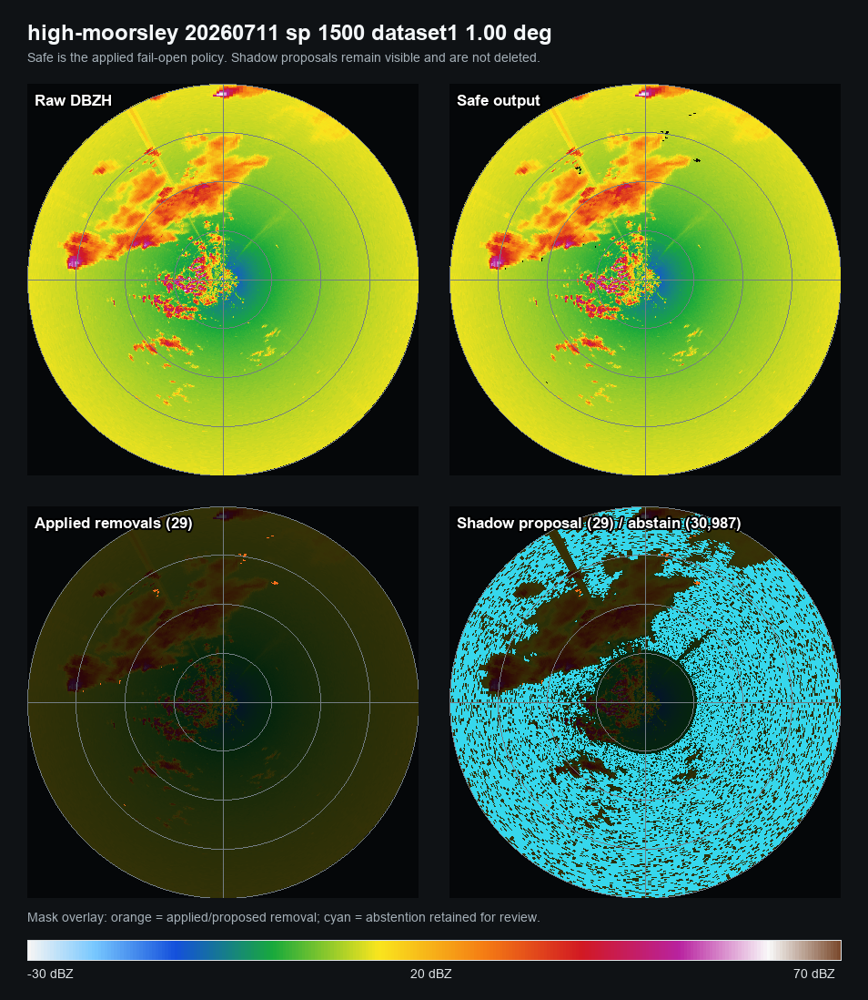
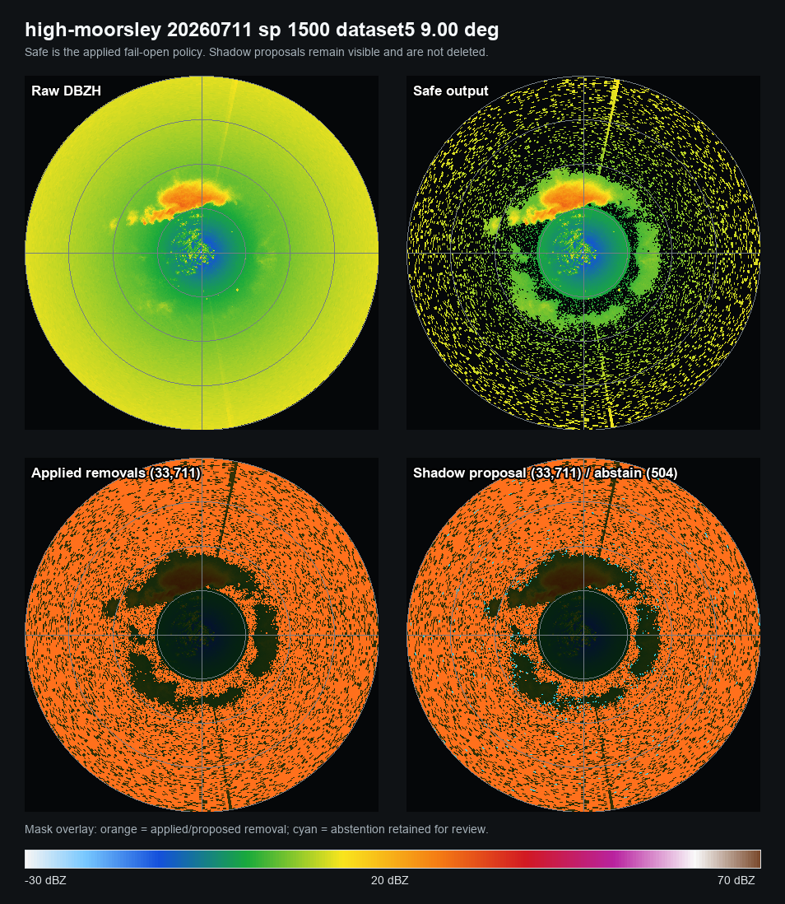
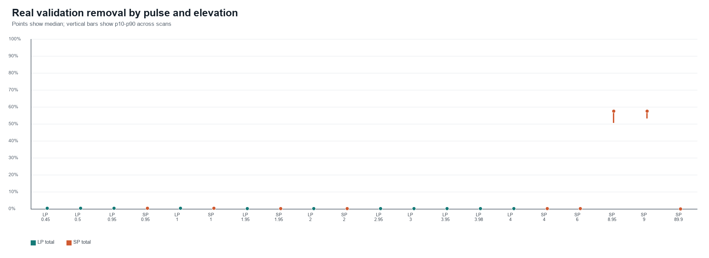
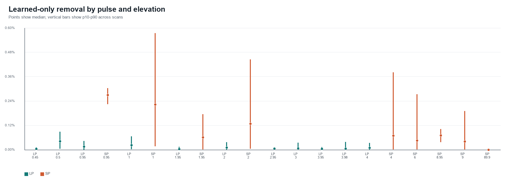
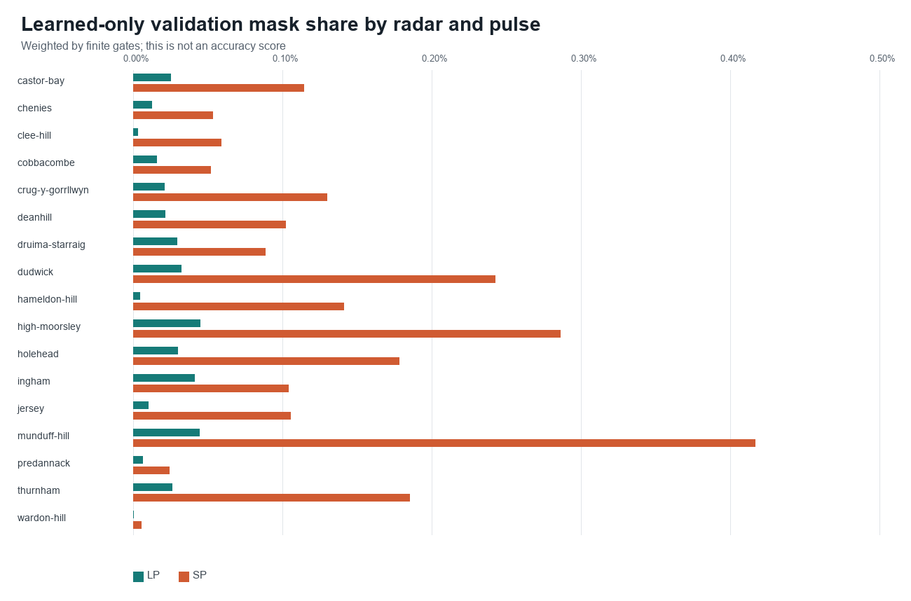
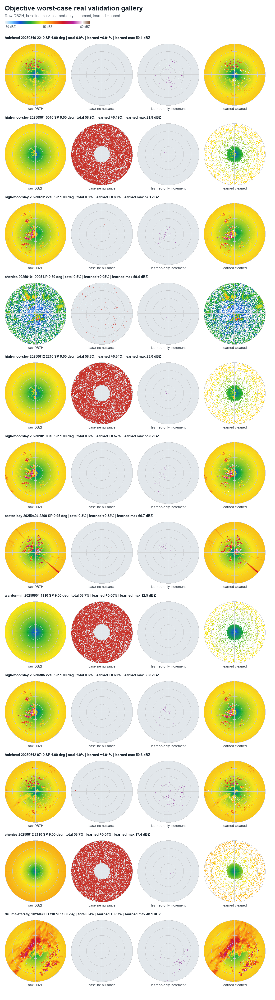
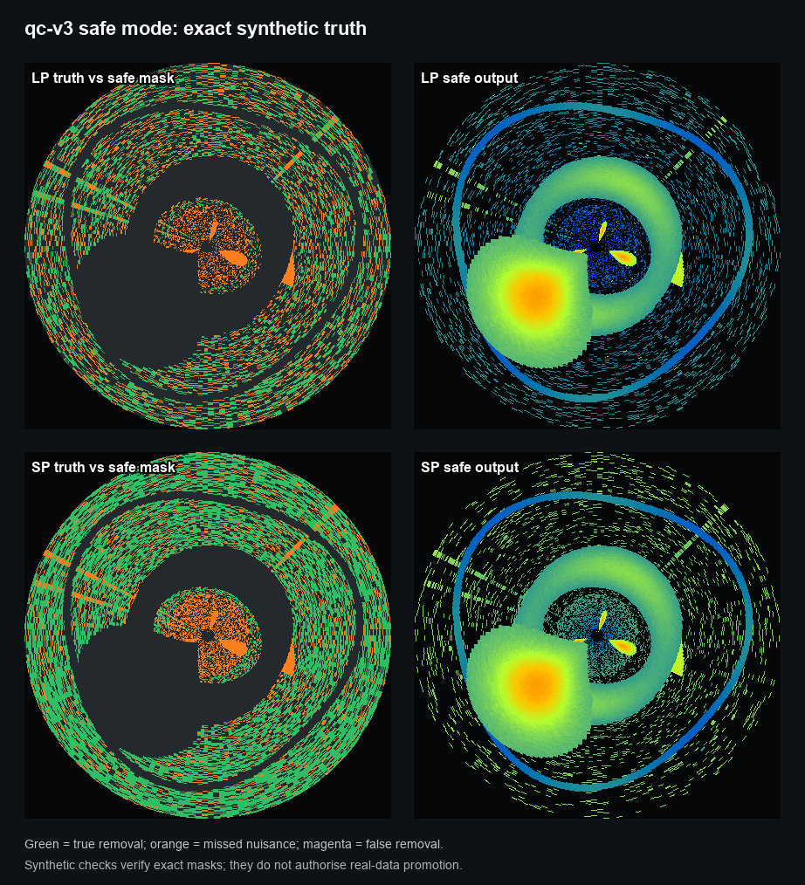

# QC v3: signal-preserving noise and clutter removal

Implementation and validation status, 2 August 2026

## Executive summary

`qc-v3` is implemented as a preservation-first nuisance detector for UK Met
Office weather-radar polar volumes. Its objective is narrow:

> Remove confirmed receiver noise and clutter while retaining precipitation,
> birds, insects, mixed echoes, clear-air atmospheric signal, and unresolved
> gates.

It is not a weather classifier, a biological classifier, or a display cleanup
effect. Every decision is represented as a scientific quality-control mask
with probabilities, reason flags, abstentions, feature availability, source
checksum, calibration stratum, and versioned provenance.

The current release posture is:

| Component | Status |
| --- | --- |
| Conservative `safe` runtime | Implemented and tested |
| Learned `shadow` runtime | Implemented; proposals do not delete gates |
| Learned `validated` runtime | Implemented; fails open without a signed, matching release bundle |
| Desktop integration | Candidate 8 can be embedded verbatim; a built macOS artifact reproduced all 187 Python masks exactly, while learned removal remains disabled |
| Native iOS integration | Native Candidate 8 reproduced all 187 Python masks exactly in an isolated simulator bundle; every model remains quarantined |
| Persisted masks and sidecars | Implemented |
| Exact synthetic validation | Passed |
| Real PVOL regression execution | Complete for the two pinned failures, 1,496 Candidate 8 development sweeps, and 1,152 frozen holdout sweeps across every corpus identifier |
| Candidate-bound safety review | Complete; all four proposals were marked `Missed nuisance`, with no preservation objection and four efficacy warnings |
| Candidate 8 holdout disposition | Rejected: 26 of 144 target geometries quarantined; 118 remain review-only; 0 are promotion eligible |
| Candidate 9 development shadow | Implemented as separate receiver-noise, learned static-clutter/AP, radial-interference, and residual-speckle experts with explicit conflicts and abstention |
| Candidate 9 exact synthetic validation | 12 disjoint holdout scenes passed with 88,114/88,114 retained gates preserved and 85.47% nuisance recall |
| Candidate 9 real development validation | 680/680 jobs completed: 170 PPI target geometries, every corpus radar identifier, both pulses, four dates per target, zero errors, and no holdout access |
| Candidate 9 exact development audit | Complete coverage and 680/680 exact artifacts passed; 58/170 target strata were quarantined by reject-only footprint screens |
| Candidate 9 human review | A new eight-case all-elevation review is prepared; 0/8 decisions were persisted when this report was updated |
| Learned-model promotion | Candidate 8 is rejected; Candidate 9 is also rejected in its current form and remains development-shadow only |

The app default remains the minimal `safe` policy. Candidate 8 is available
only as shadow evidence and is not allowed to remove data in desktop or iOS.
A future learned background model must pass the independent,
preservation-first release process defined below.

## Scientific design

### Preserve echo classes; detect nuisance mechanisms

A conventional precipitation-only gate filter is unsuitable for this project.
Low correlation coefficient, low signal quality, near-zero velocity, weak
reflectivity, or spatial texture can occur in insects, birds, mixed-phase
weather, clear-air echoes, and clutter. None is a sufficient deletion rule.

`qc-v3` instead separates the nuisance mechanisms:

- receiver noise;
- persistent ground clutter;
- anomalous propagation;
- sea clutter;
- wind-turbine contamination;
- radial interference;
- isolated speckle;
- invalid or missing source data.

Each mechanism has its own evidence path. Unsupported or contradictory gates
abstain and remain visible.

This structure follows the strongest ideas in operational and community
systems without pretending that archived ODIM moments can reproduce signal
processing that requires I/Q data:

- wradlib separates Gabella clutter detection from fuzzy echo
  classification;
- Py-ART combines moment thresholds and textures in gate filters;
- LROSE RadxPid uses wavelength- and transmit-mode-specific fuzzy
  configurations;
- BALTRAD/RADVOL-QC decomposes artefacts into separate detectors and quality
  fields;
- conditional clutter mitigation applies filtering only where clutter has
  first been identified.

### Three runtime modes

| Mode | Applied deletion | Learned output |
| --- | --- | --- |
| `safe` | Only the minimal high-confidence evidence rules | Candidate probabilities and abstentions are retained for audit |
| `shadow` | Exactly the safe mask | Learned proposals are measured but never applied |
| `validated` | Learned proposal only when a hash-valid released bundle supports the exact stratum | Otherwise fails open to the safe mask |

The calibration stratum includes radar identifier, pulse type, elevation,
quantity, and available-field regime. A model released for one stratum cannot
silently operate in another.

### Evidence policy

- `CI` is auxiliary evidence only. It is never a truth label or a sole
  deletion rule. Its relationship to clutter and noise is calibrated per
  radar, pulse, elevation, range, and field regime.
- `LONG_RANGE_NOISE_DBC_H/V` remains disabled. It can be enabled only for an
  exact stratum whose audit establishes non-sentinel semantics and incremental
  value beyond interpretable LOG/SNR/SQI and texture evidence.
- A learned background is a prior, not a mask. It requires current-scan and
  cross-scan confirmation.
- The base learned map requires at least 12 distinct training dates spanning
  at least 90 days.
- Seasonal or time-of-day buckets require at least two years of coverage and
  at least 12 dates in each bucket.
- Every background map, calibration table, and historical statistic is refit
  inside each training fold. Validation and holdout dates cannot contribute to
  those priors.
- Isolated-speckle deletion is disabled in the safe runtime.

### Automatic companion gathering

For desktop processing, `qc-v3` now automatically gathers:

- previous and next DBZH;
- previous and next VRAD when present;
- the next compatible elevation DBZH;
- same-sweep CI, SQI, RHOHV, ZDR, PHIDP, WRADH, VRADH, and other supported
  moments.

Temporal scans must use the same pulse, compatible elevation, ray/range
geometry, and a gap no greater than 20 minutes. Upper-elevation support must
have the same ray/range geometry. A missing download, field, or geometry match
removes only that evidence source; it does not fail the frame or delete a
gate.

The desktop PPI, preview metadata, point inspection, PNG export, and
`qc_mask` export paths all use the same context resolver. This prevents the
interactive view and its persisted scientific mask from silently evaluating
different evidence.

Native iOS resolves the same adjacent-volume and upper-elevation context before
running its local evaluator. The port gathers upper DBZH, VRAD, SQI, RHOHV,
ZDR, PHIDP, and spectrum width when present. Its shared six-case fixture covers
missing upper context, DBZH-only protection, independently confirmed static
nuisance, dynamic-velocity protection, and fail-open behavior.

## Output contract

Each sweep produces a `QCMaskResultV3` with:

- applied removal mask;
- proposed learned-removal mask;
- abstention mask;
- probability for each nuisance mechanism;
- candidate and applied reason flags;
- retained-quality score;
- feature-availability flags;
- calibration stratum;
- source checksum;
- exact array hashes;
- runtime policy and model qualification;
- finite-gate counts before and after masking.

The exact arrays are stored in compressed NPZ and a JSON sidecar stores the
contract, counts, hashes, model identifiers, and provenance. The source PVOL
is never modified. Desktop `qc_mask` exports use this v3 contract while
retaining a compatibility `mask` array for existing readers.

## Real-data regression results

The immutable regression manifest contains the two user-reported High
Moorsley failures:

- LP, 11 July 2026 at 14:00 UTC, reported near-total loss at 4 degrees;
- SP, 11 July 2026 at 15:00 UTC, reported 97.3% loss at 1 degree.

The manifest pins previous/current/next PVOLs by SHA-256. Six files were
verified and every DBZH sweep in each current PVOL was evaluated: five LP
elevations and six SP elevations.

| Measure | LP | SP | Combined |
| --- | ---: | ---: | ---: |
| Sweeps | 5 | 6 | 11 |
| Finite gates | 765,000 | 397,800 | 1,162,800 |
| Safe removals | 683 | 34,475 | 35,158 |
| Safe removal share | 0.089% | 8.666% | 3.024% |
| Abstentions retained | 26,235 | 125,879 | 152,114 |
| Abstention share | 3.429% | 31.644% | 13.082% |

At the two reported elevations:

| Case | Finite gates | Safe removals | Share | Abstentions retained |
| --- | ---: | ---: | ---: | ---: |
| LP 3.95 degrees | 153,000 | 60 | 0.039% | 2,454 |
| SP 1.00 degree | 68,040 | 29 | 0.043% | 30,987 |

The SP 1-degree result is the critical regression: the old app removed 97.3%
of the displayed sweep; `qc-v3` safe mode removes 0.043%. Weather and the
near-radar mixed echo remain visible.



The combined removal percentage is dominated by SP at 9 degrees. That sweep
contains a broad annular pedestal; the safe receiver-noise rule removes 33,711
of 68,040 gates (49.55%). Those gates account for 95.9% of all removals in the
11-sweep run. This appearance and its supporting moments are consistent with
receiver noise, but appearance is not truth. The sweep is explicitly retained
as a high-priority human-review case.



For this run:

- safe and shadow applied masks are byte-identical;
- no learned bundle or background prior is loaded;
- long-range-noise fields are disabled;
- isolated-speckle deletion is disabled;
- all candidate uncertainty remains visible.

These are descriptive results, not accuracy estimates. Without blinded human
truth, they cannot establish removal precision or retained-signal recall.

## Date-balanced Candidate 8 network validation

Candidate 8 adds a training-fold-only static background prior and conditional
multi-elevation confirmation. Upper-elevation reflectivity protects a gate by
default. It may instead confirm static nuisance only when upper companion
moments show near-zero velocity plus low RHOHV, or at least two independent
nuisance evidence families. Missing upper moments fail open.

The training partition contains 1,632 hash-verified HDF5 files: 17 radar
identifiers, 48 LP and 48 SP files per identifier, and 24 distinct dates per
pulse. It produced 187 exact geometry models, covering both pulse modes and
all 11 native geometries for every corpus identifier. All priors use only the
training partition. Their metadata explicitly records zero validation and zero
holdout sources. The 112 files whose byte sizes differ from stale catalogue
metadata pass content, HDF5, DBZH and SHA-256 checks and remain separately
reported. Vertical models are retained for completeness and decoding tests,
but two-dimensional learned subtraction is disabled for vertical geometry.

The independent validation partition contains 3,264 verified files in 272
complete temporal sequences. Fixed stratified selection produced eight sweeps
per model from four validation dates with day/night coverage. The resulting
1,496 evaluations cover every trained target; all have bracketing temporal
context and 1,086 have a compatible higher-elevation scan. At the point when
the Candidate 8 policy was frozen, the sealed holdout remained untouched.

| Group | Finite gates | Safe baseline | Learned-only addition | Candidate total |
| --- | ---: | ---: | ---: | ---: |
| All | 158,140,800 | 3.4303% | 0.0602% | 3.4905% |
| LP | 104,040,000 | 0.1404% | 0.0216% | 0.1620% |
| SP | 54,100,800 | 9.7570% | 0.1345% | 9.8914% |

Candidate 8 adds 95,277 proposed removals: 95,086 attributed to persistent
static clutter and 191 to anomalous propagation. It removes zero gates marked
by deterministic protection and zero gates with independent upper-elevation
signal support. The median learned-only share is 0.0222% per sweep, the p90 is
0.2381%, and the maximum is 2.1546%. These are footprint measurements, not
accuracy estimates.

The real-data audit also found cases that prohibit automatic promotion. The
learned-only mask reaches 72.3 dBZ in one sparse Dudwick LP case, and several
SP scans contain coherent high-reflectivity regions requiring human review.
The safe receiver-noise baseline also removes roughly 50-59% of many SP
9-degree annular scans. Those high-baseline strata are quarantined rather than
being used as evidence that the learned model is correct.

The frozen pre-holdout policy places 43 of 187 targets in quarantine and routes
the remaining 144 to blinded review. No target is promotion eligible at this
stage. Blockers overlap and include 17 vertical targets, 18 targets with
extreme baseline removal, 13 with a learned-context rescue discrepancy, three
with excessive learned-only linear reflectivity, and two with unstable
learned-only masks. The policy can reject or request review; it cannot promote
a model.









Py-ART and wradlib were also run as reproducible challenge baselines on the
earlier pinned development sweeps. wradlib fuzzy p20, Gabella and fold-local
histo-cut flag 4.91%, 7.01% and 10.00% of valid gates; Py-ART's broad
moment/texture gate filter flags 95.66%. These footprints intersect
signal-protection masks and high-DBZH echoes, so none is used as a direct
removal default.

The original four-case page compared Candidate 8 with a more aggressive
moderate ablation. It is retained as development evidence but cannot authorise
holdout access, regardless of its answers. A replacement four-case safety
review is bound to the exact conservative Candidate 8 configuration, runtime
contract, portable model manifest, and gallery SHA-256. It contains two LP and
two SP cases from four radars, selected from larger connected high-risk
proposals. Every case shows raw DBZH, VRADH on -5 to +5 m/s, cleaned DBZH,
the exact proposal, fold-local static frequency, upper-elevation confirmation,
and companion moments. The reviewer completed all four cases and marked every
proposal `Missed nuisance`: no preservation objection was recorded, but all
four cases warned that the candidate was visibly ineffective.

Review completion and review acceptance are separate gates. `Too aggressive`
is a hard preservation stop, `Uncertain` abstains and stops release,
`Missed nuisance` is a safety pass with an efficacy warning, and `Correct` is
a safety pass. The annotation is accepted only when its stored review ID and
gallery hash match the exact report. Candidate 8 therefore passed this narrow
pre-holdout safety check but did not receive evidence of useful nuisance
removal.

Exact all-model parity is complete: all 187 models reproduce the same
321,327-gate mask and the same per-model mask hashes in the Python core, the QC
source embedded in a built macOS app, and the native iOS production classifier.
The parity evidence contains zero errors and covers 170 PPI and 17 fail-open
vertical models. A version-2 release-freeze builder independently checked the
decision semantics, candidate identity, all evidence hashes, frozen policy,
then-sealed holdout, and all-platform parity. Every pre-holdout check passed,
so the exact Candidate 8 holdout was authorised. Desktop and iOS defaults
remained unchanged throughout.

The portable runtime contract SHA-256 is
`177b3534085f4571f014b5060527562202527a626ee1d907bb54ed8dd6162336`.
The all-model parity fixture SHA-256 is
`a112e84109f40acc78aacb1a43716e3a03f9196f507141d035ecc73773051923`.
The prior checkpoints were private Python commit `d176485`, native iOS commit
`7db2f35`, and desktop commit `bd7f8e3`. Current all-radar validation artefacts
are content-addressed separately; final commit identifiers and complete test
counts are recorded only after the remaining review work is frozen.

### Frozen Candidate 8 holdout result

The release freeze was written before any holdout file was accessed. Its
SHA-256 is
`4b4090b0ef563a4435305cd357d7012132c143a275fbee01f9e2270b5963763f`.
The downloader then retrieved and content-verified 3,264 PVOL/HDF5 files
(16.037 GiB) with zero failures. The 480 catalogue-size mismatches were
accepted only after file-content, HDF5, DBZH, and SHA-256 validation; they are
recorded as catalogue drift, not silently ignored.

The immutable job plan selected eight diverse whole-volume sweeps for each of
the 144 authorised PPI target geometries: 1,152 evaluations across all 17
radar identifiers represented in the corpus. All 1,152 had complete temporal
context and 880 had compatible upper-elevation context. The post-run integrity
audit passed all 1,152 persisted masks with zero errors.

| Group | Sweeps | Finite gates (million) | Safe baseline | Learned-only addition | Candidate total |
| --- | ---: | ---: | ---: | ---: | ---: |
| All | 1,152 | 135.4752 | 3.9321% | 0.0826% | 4.0146% |
| LP | 672 | 102.8160 | 0.1787% | 0.0305% | 0.2091% |
| SP | 480 | 32.6592 | 15.7483% | 0.2466% | 15.9948% |

The learned-only mask proposed 111,837 additional removals: 111,631 static
clutter and 206 anomalous-propagation gates. It removed zero deterministically
protected gates and zero gates with independent upper-elevation signal
support. Those useful invariants were not enough for release. Nine geometries
failed the learned-only reflectivity-power screen, 13 showed a context-rescue
discrepancy, and 43 baseline removals changed when learned context was added.
The learned mask reached 72.5 dBZ, and its worst single-sweep share of linear
reflectivity was 16.74%.

The safe baseline also failed independently: 17 geometries had both extreme
removal fractions and excessive removed reflectivity power, dominated by SP
6-degree scans. The final post-holdout disposition therefore quarantines 26
target geometries and leaves 118 as review-only. Every corpus radar identifier
has at least one quarantined geometry. No target is promotion eligible and
**Candidate 8 is rejected**.

An eight-case diagnostic gallery now samples the learned-specific failures
using three LP and five SP real holdout cases. It shows raw DBZH, VRADH on
-5 to +5 m/s, Candidate 8 output, the exact proposal, fold-local static prior,
upper-elevation confirmation, and companion moments. This review can identify
failure mechanisms for Candidate 9; it cannot reverse the Candidate 8
rejection or authorise deployment.

Because the Candidate 8 holdout has been opened, it is now diagnostic evidence
only. Candidate 9 thresholds, priors, and feature rules must be developed from
training/development data. A new, later time partition must be selected and
sealed before Candidate 9 tuning starts, then opened only after a new release
freeze and cross-platform parity proof.

## Candidate 9 development iteration

Candidate 9 does not modify the frozen Candidate 8 classifier. It composes
four mechanism-specific experts and records each expert's raw proposal before
fusion:

- receiver noise from a qualified radar-equation range profile plus direct
  receiver-quality evidence (`SQI`, `SNR`, `LOG`, valid-data frequency,
  encoded floor, or a qualified LP power mode);
- static clutter and anomalous propagation from a fold-local, date-balanced
  background prior confirmed by current-scan polarimetric, Doppler, temporal,
  and upper-elevation evidence;
- narrow radial interference from azimuthal excess and low Doppler coherence;
- residual speckle from local support, temporal support, and distance from the
  qualified noise profile.

Receiver proposals never consume learned background arrays. Receiver-specific
high-SQI protection remains inside the receiver expert and cannot veto a
static-clutter proposal. Strong coherent-Doppler or upper-elevation signal
evidence may protect a proposal, but every such change is persisted as a
conflict and abstention. Source DBZH is unchanged; a separate diagnostic array
shows the proposed result. Candidate 9 is shadow-only and not promotion
eligible.

The exact Candidate 9 synthetic run trained a separate date-balanced
background for each pulse on 32 scenes and evaluated six disjoint seeds per
pulse at 120 rays by 160 gates. The suite passed all accounting,
source-immutability, learned-context monotonicity, and reason-union invariants.

| Metric | Candidate 9 result |
| --- | ---: |
| Retained gates | 88,114 |
| Retained gates removed | 0 |
| Removal precision | 1.0000 |
| Overall retained recall | 1.0000 |
| Precipitation recall | 1.0000 |
| Biological-echo recall | 1.0000 |
| Clear-air atmospheric recall | 1.0000 |
| Retained objects | 36 |
| Completely removed retained objects | 0 |
| Minimum object area preserved | 1.0000 |
| Overall nuisance recall | 0.8547 |
| Receiver-noise recall | 0.9188 |
| Static-clutter recall | 0.5984 |
| Radial-interference recall | 0.8045 |
| Isolated-speckle recall | 0.1611 |
| Anomalous-propagation recall | 0.0000 |

The AP result is an explicit efficacy gap, not a reason to relax preservation
rules. AP remains visible unless the available evidence proves nuisance.

The first real-data development smoke used only the grouped `validation`
split. It ran one low-elevation LP and one low-elevation SP job for every one
of the 17 radar identifiers represented in the corpus. All 34 jobs completed
without errors; the opened Candidate 8 holdout was not read.

| Group | Jobs | Finite gates | Final proposal | Abstained and retained | Linear-Z share proposed |
| --- | ---: | ---: | ---: | ---: | ---: |
| All | 34 | 3,757,680 | 15.92% | 44.40% | 1.17% |
| LP | 17 | 2,601,000 | 22.12% | 36.92% | 1.09% |
| SP | 17 | 1,156,680 | 1.98% | 61.20% | 1.72% |

The large LP/SP difference and high abstention rate are development findings,
not accuracy claims. These scans have no complete gate truth. The exact final
proposal contains 565,172 receiver-noise, 2,736 static-clutter, 2,724 radial-
interference, 29,094 residual-speckle, and 14 AP reason assignments; reason
masks can overlap. The eight-case Candidate 9 review deliberately samples
both high preservation-risk and large efficacy-footprint cases. Until that
review is persisted, the real-data result establishes only execution,
coverage, provenance, and review targets.

### All-elevation, multi-date development audit

The next development run evaluated every non-vertical PPI target represented
in the verified validation corpus. Each of the 17 radar identifiers
contributed five LP elevations and five SP elevations. Four distinct dates
were selected for every target before any same-date repeat was allowed. The
680 jobs span 170 target geometries, 19 source dates, all four seasons, both
pulse modes, and native elevations from 0.45 to 9.0 degrees. The opened
Candidate 8 holdout was not accessed.

| Group | Jobs | Finite gates | Final proposal | Abstained and retained | Linear-Z share proposed | Gates at or above 35 dBZ |
| --- | ---: | ---: | ---: | ---: | ---: | ---: |
| All | 680 | 75,153,600 | 30.71% | 49.01% | 0.760% | 2,148 |
| LP | 340 | 52,020,000 | 35.61% | 42.85% | 0.661% | 1,435 |
| SP | 340 | 23,133,600 | 19.68% | 62.86% | 2.009% | 713 |

The reject-only audit re-opened every compressed mask and sidecar and checked
source hashes, configuration hashes, source immutability, mask union,
mechanism attribution, protection/abstention invariants, exact diagnostic
output, target coverage, and date coverage. All 680 artifacts passed and no
target was missing. This validates execution and provenance, not echo truth.

The current candidate nevertheless failed the development safety screen:

- 58 of 170 target strata are in diagnostic quarantine and 112 require human
  review; none is promotion eligible;
- all 17 SP targets at approximately 9 degrees were quarantined, with
  per-sweep proposed fractions as high as 99.26% and linear-Z shares as high
  as 99.98%; these proposals are almost entirely receiver-noise assignments;
- 40 LP targets were quarantined by the per-sweep reflectivity-power screen,
  concentrated between 2 and 4 degrees; and
- one SP 1-degree target was also quarantined by that power screen.

A large proposal is not itself proof of error: several high-elevation scans
are dominated by a smooth range-dependent pedestal and may genuinely contain
mostly receiver background. It is also not proof of correctness. A new
eight-case review therefore includes two LP weather-rich low elevations, two
LP 3.95--4-degree high-footprint cases, two SP 9-degree near-total proposals,
and two SP 1-degree weather-rich cases. Raw DBZH, VRADH on -5 to +5 m/s, the
diagnostic result, mechanism masks, fold-local static frequency, companion
moments, and abstained gates are shown together. Reviewer decisions must be
read from the persisted annotation file; chat acknowledgements are not
evidence.

## Exact synthetic validation

The current exact-truth suite uses 24 independently seeded scenes: 12 LP and
12 SP. Each scene contains disjoint precipitation, biological, and clear-air
objects plus exact receiver-noise, static-clutter, anomalous-propagation,
radial-interference, and isolated-speckle masks.

Temporal brackets are complete but deliberately disagree by 5 dB and use
opposing high velocities. This prevents accidental temporal persistence from
becoming clutter evidence.

| Metric | Result |
| --- | ---: |
| Retained gates | 361,314 |
| Retained gates removed | 0 |
| Removal precision | 1.000 |
| Overall retained recall | 1.000 |
| Precipitation recall | 1.000 |
| Biological-echo recall | 1.000 |
| Clear-air recall | 1.000 |
| Retained objects | 72 |
| Completely removed retained objects | 0 |
| Minimum object area preserved | 1.000 |
| Nuisance recall | 0.546 |

Nuisance recall is intentionally secondary:

| Nuisance | Safe-mode recall |
| --- | ---: |
| Receiver noise | 0.612 |
| Radial interference | 0.330 |
| Isolated speckle | 0.011 |
| Static clutter | 0.000 |
| Anomalous propagation | 0.000 |

Static clutter and AP remain visible when the minimal evidence path cannot
prove nuisance. That is the intended safe baseline. A learned model must
improve these recalls only after every preservation gate passes.



Synthetic validation checks deterministic masks and implementation errors. It
does not authorise real-data promotion.

## Learned background design

The learned artefact is keyed by radar identifier, pulse type, elevation,
quantity, geometry, and optional qualified seasonal/time bucket. Polar
azimuth-by-range statistics include:

- persistent echo date frequency;
- median, p10, and p90 DBZH;
- near-zero VRAD date frequency;
- low-SQI date frequency;
- low or unstable RHOHV/ZDR frequency;
- sample/date counts and coverage span.

The model receives only training-fold dates. A gate can become a learned
clutter proposal only when the prior is qualified and the current scan supplies
multiple independent evidence families, complete temporal support, and
upper-elevation evidence where expected. A learned prior never overrides
coherent Doppler, spatial, temporal, or upper-elevation protection.

## Human review

One reviewer is sufficient for this project if reliability is measured.
Review is organised around connected regions, not complete 24-sweep batches.
The queue ranks:

- disagreement between safe rules, learned proposal, and community baselines;
- probability near the decision threshold;
- under-represented radar/pulse/elevation/range/season strata;
- high-reflectivity or coherent objects at risk;
- high-removal scans such as the SP 9-degree case;
- suspected sea clutter, AP, turbines, and interference.

For each region the reviewer chooses `Keep`, `Remove`, or `Uncertain`, adds a
nuisance subtype only when `Remove` is selected, and may paint corrections.
Validation and holdout prelabels are hidden. Events are append-only and retain
review duration, source checksum, and mask hashes.

The pre-holdout image sanity check uses four outcome buttons because it asks a
different question: whether an exact candidate proposal is safe and useful.
Its decisions are `Correct`, `Too aggressive`, `Missed nuisance`, and
`Uncertain`. Completion alone never passes this gate. `Too aggressive` and
`Uncertain` block holdout access; `Missed nuisance` records an efficacy warning
without claiming that the candidate removed enough nuisance. The report,
annotation, configuration, contract, model manifest, frozen policy, and parity
evidence are all content-addressed before holdout access can be authorised.

The post-holdout Candidate 8 gallery asks the same four-button question over
larger connected failure regions. Its purpose is diagnosis only. Reviewer
notes may identify which evidence path failed, but no answer can convert a
failed frozen holdout into a pass or be used to retune Candidate 8.

Ten percent of decisions are repeated blindly after at least 14 days. The
release report includes raw agreement and Cohen's kappa for
`Keep/Remove/Uncertain`. Kappa is reported as a measurement-quality result,
not used as a pass/fail target that could encourage internally consistent but
incorrect labels. `Uncertain` regions are retained, excluded from supervised
truth, and remain available for later review.

## Release criteria

Whole PVOL/date groups are kept intact across train, calibration, validation,
and sealed holdout splits. Thresholds are selected to satisfy preservation
risk first, then maximise nuisance recall. Low-confidence gates abstain.

The original provisional requirement of 99.9% retained-gate recall has been
withdrawn. It expressed false precision that cannot be supported by a small,
single-reviewer label set. Promotion instead uses a paired selective-
classification design: each future candidate and the safe baseline are
evaluated on the same high-confidence labelled objects and whole-volume
groups. A one-sided grouped confidence bound must show that the candidate is
non-inferior for signal preservation and better for confirmed nuisance
removal. The practical non-
inferiority margin is frozen after the blinded repeat-review reliability audit
and before the holdout is opened; it cannot be changed after seeing holdout
results.

No learned candidate can be promoted unless its sealed real holdout meets
all of the following:

| Gate | Required value |
| --- | ---: |
| Gates marked protected by deterministic evidence | 0 removed |
| Gates with independent upper-elevation signal support | 0 removed |
| Completely removed high-confidence retained objects | 0 |
| Candidate preservation versus safe baseline | paired one-sided 95% bound within the frozen non-inferiority margin |
| Candidate nuisance removal versus safe baseline | grouped 95% improvement bound above 0 |
| Results by radar/pulse/elevation/range/season | published with confidence intervals and worst-case objects |
| Reviewer repeat reliability | measured and used to freeze the non-inferiority margin before holdout |
| `Uncertain` review regions | retained and excluded from truth labels |
| Sparse or unsupported strata | fail open |
| Vertical geometry | learned subtraction disabled until separately validated |
| Python/desktop/iOS masks, abstentions, and reasons | byte-identical |

Absolute gate recall, removal precision, and retained-object area are still
reported, but they are not assigned unsupported decimal-place thresholds.
Threshold selection remains preservation first: maximise confirmed nuisance
removal only within the paired preservation-safe region.

Candidate 8 failed the frozen real-data safety screens before any uncertain
human-label statistic was needed. Its diagnostic review can guide hypotheses,
but it cannot change that disposition.

## Deployment policy

1. Keep `safe` as the desktop and iOS default; retain Candidate 8 as rejected
   shadow evidence only.
2. Complete the new all-elevation eight-case Candidate 9 development review
   and treat `Too
   aggressive` or `Uncertain` as a preservation stop, not as a prompt to tune
   against the opened Candidate 8 holdout.
3. Retain the implemented separate receiver-noise, learned static-clutter/AP,
   radial-interference, and residual-speckle decision paths; do not collapse
   them into a single echo classifier.
4. Audit CI and long-range-noise semantics per radar, pulse, elevation, range,
   and available-field regime.
5. Require context to be monotonic: adding learned or upper-elevation evidence
   may protect a gate or add a confirmed learned proposal, but may not silently
   change an unrelated baseline decision.
6. Correct the receiver-noise qualification and protection logic using only
   grouped development evidence, then rerun the completed 680-job audit.
   Preserve the high-reflectivity, linear-Z, object-level, and reason-specific
   reject-only checks in every iteration.
7. Select a new, later sealed temporal holdout before Candidate 9 tuning; never
   reuse the opened Candidate 8 holdout for optimisation.
8. Freeze code, thresholds, priors, review evidence, and platform hashes before
   opening the new holdout.
9. Require the preservation and Python/desktop/iOS parity gates above.
10. Roll out a passing model in shadow across every radar identifier represented
    in the corpus before changing any default.

There is no `Strong` user mode while learned subtraction is unvalidated.

## Reproduction

Run the real pinned regressions:

```bash
PYTHONPATH=src:/path/to/Avocet/src python \
  tools/validate_qc_v3_regression_manifest.py \
  --source-root /path/to/verified/pvol/files
```

Run the exact synthetic suite:

```bash
PYTHONPATH=src:/path/to/Avocet/src python \
  tools/validate_qc_v3_synthetic.py
```

Run the Candidate 9 exact synthetic suite:

```bash
PYTHONPATH=src:/path/to/Avocet/src python \
  tools/validate_candidate9_synthetic.py
```

Run the Candidate 9 grouped development smoke without holdout access:

```bash
PYTHONPATH=src:/path/to/Avocet/src python \
  tools/validate_candidate9_development.py --max-jobs 34
```

Run four distinct development dates for each PPI target and audit the exact
persisted artifacts:

```bash
PYTHONPATH=src:/path/to/Avocet/src python \
  tools/validate_candidate9_development.py \
  --jobs-per-target 4 --resume \
  --artifact-root /path/to/candidate9-artifacts \
  --report /path/to/candidate9-reports/all.json
PYTHONPATH=src python tools/audit_candidate9_development.py \
  --report-dir /path/to/candidate9-reports \
  --output /path/to/candidate9-development-audit.json
```

Build and serve the persistent eight-case Candidate 9 review:

```bash
PYTHONPATH=src:/path/to/Avocet/src python \
  tools/build_candidate9_review_gallery.py \
  --validation-results /path/to/candidate9-reports/all.json \
  --output-dir validation/qc_candidate9_all_elevation_review_20260802_v1
PYTHONPATH=src python tools/serve_two_layer_review.py \
  --gallery validation/qc_candidate9_all_elevation_review_20260802_v1 \
  --reviewer rrniii --host 0.0.0.0 --port 8772
```

Reproduce the post-holdout disposition from a completed, audited holdout
report:

```bash
PYTHONPATH=src python tools/assess_background_holdout.py \
  --holdout-results reports/background_validation_candidate8_holdout/holdout_results.json \
  --output reports/background_validation_candidate8_holdout/disposition.json
```

The real report includes per-sweep CSV, colour-barred plots, compressed exact
masks/probabilities, JSON sidecars, input hashes, and array hashes.

## References

- [Met Office radar network and dual-polarisation programme](https://www.metoffice.gov.uk/research/approach/observations/weather-radar)
- [Met Office receiver-noise estimator](https://www.metoffice.gov.uk/research/news/2019/new-radar-noise-level-estimator)
- [Ivić, Curtis and Torres: automated receiver-noise estimation](https://journals.ametsoc.org/view/journals/atot/30/12/jtech-d-13-00008_1.xml)
- [wradlib clutter and echo-classification workflows](https://docs.wradlib.org/)
- [Py-ART GateFilter API](https://arm-doe.github.io/pyart/API/generated/pyart.filters.GateFilter.html)
- [LROSE RadxPid](https://github.com/NCAR/lrose-core)
- [BALTRAD/RADVOL-QC quality-control chain](https://rmets.onlinelibrary.wiley.com/doi/10.1002/met.1323)
- [ODIM HDF5 information model](https://www.eumetnet.eu/activities/observations-programme/current-activities/opera/)
- [Rico-Ramirez and Cluckie: dual-polarisation ground-clutter/AP classification](https://research-information.bris.ac.uk/en/publications/classification-of-ground-clutter-and-anomalous-propagation-using-/)
- [UK weather radar for aerial arthropod monitoring](https://doi.org/10.1111/gcb.70425)
