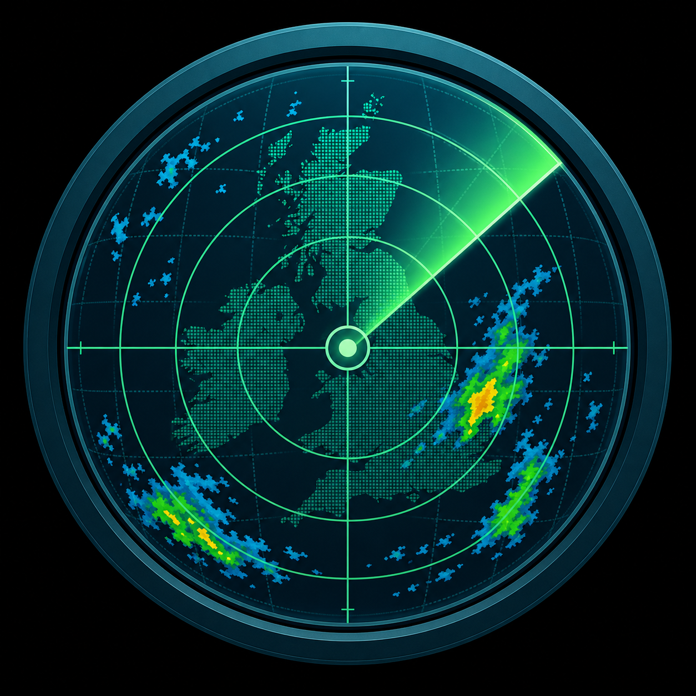

<p align="center">
  
</p>

# UK WSR Visualizer Windows Install and Use

The Windows beta is distributed as a portable zip for Windows 10/11 x64.

## Install

1. Download `UK WSR Visualizer Windows Beta.zip`.
2. Extract the zip to a normal folder such as `Documents` or `Desktop`.
3. Double-click `UK WSR Visualizer.exe`.
4. Wait on the radar logo while the bundled local server starts.

The app opens its own Windows window. It does not require a system Python
install and it does not open the default browser.

## Runtime Files

The extracted app folder is treated as read-only. Runtime files are stored in:

```text
%LOCALAPPDATA%\UK WSR Visualizer\
```

Logs are written to:

```text
%LOCALAPPDATA%\UK WSR Visualizer\uk-wsr-visualizer.log
```

Downloaded radar source files are cached at:

```text
%LOCALAPPDATA%\UK WSR Visualizer\data\remote-aggregate-cache\
```

The raw cache is disposable. Press **Clear Raw Cache** in the app to remove
cached radar source files immediately.

## Data Source

The app connects to the public JASMIN Object Store catalog:

```text
https://ncas-radar-o.s3-ext.jc.rl.ac.uk/uk-wsr-visualizer-public/uk-radar/catalog/inventory/catalog.json
```

The original observations are Met Office NIMROD single-site UK radar files held
by CEDA. The Avocet/JASMIN processing pipeline converts those files into
ODIM-like UK WSR HDF5 products, and approved products are mirrored to the JASMIN
Object Store for the app.

## WebView2

The native Windows window uses Microsoft Edge WebView2. Most Windows 10/11
machines already include it. If the app reports that WebView2 is missing,
install the Evergreen WebView2 Runtime from Microsoft:

```text
https://developer.microsoft.com/microsoft-edge/webview2/
```

## Self Test

For debugging, run this from PowerShell in the extracted folder:

```powershell
.\UK WSR Visualizer.exe --self-test
```

The self-test starts the bundled server, waits for `/api/ready`, prints
`/api/status`, and shuts down without opening the app window.
