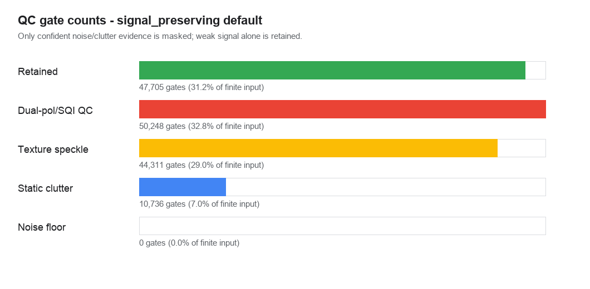

# Noise and Background Subtraction Results

Status date: 2026-07-07

This report records the current evidence for the `qc-v1` learned-background and
static-clutter cleanup path, with texture and companion-field QC retained as
explicit diagnostics rather than default app deletion rules. It is a results
document, not the full processing contract. The companion methods document is
[UKMO WSR Processing Pipeline](ukmo_wsr_processing_pipeline.md).

## Technical Summary

The current app-default configuration is still named `signal_preserving`, but
the default deletion rules are now conservative: learned persistent background
plus velocity-supported static clutter. The estimated range-dependent noise
profile remains available as evidence and audit output, but it is not a hard
reflectivity cutoff. Standalone texture-speckle and companion-field QC are
explicit diagnostics, not the default, because they over-removed broad weak
structure in clear-air biological scenes.

The regression case that exposed the over-removal was Castor Bay
`2026-07-04 00:00 UTC`, `lp`, `DBZH`, `dataset1`, `0.50 deg`. The old default
masked `127,700` of `153,000` finite gates (`83.5%`): `TEXTURE_SPECKLE=49,755`,
`DUALPOL_QC=53,048`, `STATIC_CLUTTER=15,732`, and
`BACKGROUND_CLUTTER=9,165`. The new default masks `24,897` gates (`16.3%`):
`STATIC_CLUTTER=15,732` and `BACKGROUND_CLUTTER=9,165`. The learned background
result itself did not change; the broad texture and companion-field deletion
was removed from the app default.

Synthetic/unit tests also pass for the implemented mask components: source
nodata and domain masking, legacy hard noise-floor masking,
signal-preserving low-SNR retention, texture-speckle masking, static clutter
from near-zero velocity, companion-field QC, same-dataset companion-field
auto-gathering, and legacy display-cleanup filter mapping.

The signal-preserving learned-background configuration is ready to use as the
default app/export cleanup path in the desktop and iOS apps for matching scans.
Broader VP scientific validation still needs separate checks across elevations,
pulses, seasons, precipitation regimes, and biological target regimes.

## Key Results From Real PVOL Validation

The real-data validation used the public Chenies PVOL object below and required
a real local HDF5 source file, not a synthetic fallback.

| Field | Value |
| --- | --- |
| Validation status | Passed |
| Validation type | `qc_mask` |
| Mask version | `qc-v1` |
| Cleanup mode | `signal_preserving` |
| Radar | Chenies |
| Scan time | 2026-06-25 00:00 UTC |
| Pulse | `lp` |
| Dataset/elevation | `dataset1`, `0.5 deg` |
| Quantity | `DBZH` |
| Shape | `360` rays by `425` bins |
| Gate spacing | `600 m` |
| Maximum range | `255 km` |
| Companion fields found | `DBZH`, `PHIDP`, `RHOHV`, `SQIH`, `VRADH`, `WRADH`, `ZDR` |
| Source object | `ukmo-nimrod/pvol/chenies/2026/06/25/lp/20260625_polar_pl_radar05_aggregate_lp_0000.h5` |

The figure below shows the gate-level outcome in range-azimuth coordinates. The
green gates are the finite gates retained after QC. The other colours are the
single removal reason assigned by the `qc-v1` mask in this validation artifact.


The same result as aggregate counts:



| Outcome | Gates | Share of finite input |
| --- | ---: | ---: |
| Retained after QC | 47,705 | 31.2% |
| Masked by companion/SQI QC | 50,248 | 32.8% |
| Masked by texture speckle | 44,311 | 29.0% |
| Masked by static clutter | 10,736 | 7.0% |
| Masked by hard noise floor | 0 | 0.0% |
| Total finite input | 153,000 | 100.0% |

The persisted mask result contains no overlapping removal flags for this scan:
the three non-zero removal counts sum to the total masked count of `105,295`
gates.

## The Noise Profile Is Range Dependent

The estimated floor is derived per range bin using the configured low-signal
profile method. In `signal_preserving` mode, the floor is evidence used by the
texture, companion-field, and static-clutter checks; it is not a hard cutoff.
The evidence offset is `0 dB`, hard noise-floor masking is disabled, and the
separate near-noise evidence window is `6 dB` only when combined with other
quality or texture evidence. Near the radar, the estimated floor is materially
higher; after the first few kilometres it settles into a lower background level
and then rises gradually at long range.


This profile-driven behaviour is the main reason the same fixed reflectivity
value is not treated identically at every range. For the validated scan, the
profile contributes context for texture and companion-field scoring, but it does
not independently delete weak coherent signal.

## Synthetic and Unit Validation

The synthetic tests exercise the mask mechanics independently of the Chenies
case. They are small by design, which makes them useful for proving that each
flag path is reachable and deterministic.

| Test coverage | Evidence |
| --- | --- |
| Source nodata and explicit domain masking | `NO_DATA` and `USER_DOMAIN` flags are set and masked values become `NaN`. |
| Legacy estimated noise floor and local texture | `display_standard` can still hard-mask low-profile gates and one isolated high-texture gate is flagged as `TEXTURE_SPECKLE`. |
| Signal-preserving low-SNR retention | Low reflectivity alone does not set `NOISE_FLOOR` or remove a coherent gate. |
| Static clutter | A near-zero velocity block with enough neighbouring support is flagged as `STATIC_CLUTTER`. |
| Companion QC | Low `SQIH` near the estimated profile can flag the target gate as `DUALPOL_QC`; low `RHOHV` alone is retained in the default path. |
| Companion-field auto-gathering | A synthetic ODIM/HDF5 file exposes `DBZH`, `SQIH`, and `RHOHV` to the shared filter path. |
| Legacy filter compatibility | Existing display cleanup parameters map into a deterministic `QCConfig`. |

The full project test suite passes with these checks included: `191 passed, 1
warning`. The warning is an existing Starlette/FastAPI test-client deprecation
warning and does not affect the QC result.

## Method and Configuration Used

The real-data validation was run through the same `qc_mask` export path used by
the app/API processing layer. The active app-default configuration was:

| Parameter | Value |
| --- | --- |
| `qc_mode` | `signal_preserving` |
| `noise_floor_method` | `estimated` |
| `noise_floor_percentile` | `10` |
| `noise_floor_window_bins` | `11` |
| `noise_floor_margin_db` | `0.0` |
| `noise_floor_hard_mask` | `false` |
| `near_noise_margin_db` | `6.0` |
| `rhohv_low_is_noise_evidence` | `false` |
| `companion_qc_near_noise_only` | `true` when companion QC is explicitly enabled |
| `texture_enabled` | `false` by default in `signal_preserving` |
| `companion_qc_enabled` | `false` by default in `signal_preserving` |
| `background_model_enabled` | `true` for matching default model keys |
| `static_clutter_enabled` | `true` |
| `static_clutter_dbz_min` | `5.0` |
| `static_clutter_vrad_abs_max_ms` | `1.0` |
| `static_clutter_min_neighbors` | `3` |
| `score_threshold` | `4` |
| `near_noise_score_threshold` | `3` |

The validation command was:

```bash
PYTHONPATH=src .venv/bin/python -c 'import sys; from uk_wsr_visualizer.cli import main; sys.exit(main(sys.argv[1:]))' \
  validate qc \
  --catalog /tmp/chenies_real_catalog.json \
  --radar chenies \
  --date 20260625 \
  --pulse lp \
  --time 0000 \
  --quantity DBZH \
  --dataset 1 \
  --qc-mode signal_preserving \
  --noise-floor-margin-db 0 \
  --output-dir /tmp/uk_wsr_qc_validation_signal \
  --report /tmp/uk_wsr_qc_validation_signal/report.json \
  --require-real-hdf5
```

The persisted result was a compressed mask product plus JSON sidecar:

| Artifact | Result |
| --- | --- |
| Mask `.npz` | `chenies_20260625_DBZH_qc_mask.npz`, `133,023` bytes, SHA256 `29b3f0a063fff20ae2a4a7a092347416df165c71331b988b82125a5484903edf` |
| Sidecar `.json` | `chenies_20260625_DBZH_qc_mask.npz.json`, `15,520` bytes, SHA256 `4dbea0887c1b92709baf041dc7ec66372adb38a693a7b488303a25bc1f532d15` |

## Interpretation

The signal-preserving learned-background configuration is doing what it is now
designed to do: it removes persistent learned background and stationary clutter
without treating low reflectivity, texture, or weak companion evidence as a
sufficient deletion reason. The retained gate count in the Castor Bay regression
case increased from `25,300` gates (`16.5%`) under the old aggressive default to
`128,103` gates (`83.7%`) under the new default while still removing the same
`9,165` learned-background gates.

The most important technical result is that the pipeline now emits a persistent,
auditable gate mask rather than only a display-side cleaned image. That makes the
result inspectable by flag, reproducible through the CLI, and suitable for the
next stage of VP pipeline integration.

## Limitations and Robustness

This is a first real validation result, not a full validation campaign. The
largest limitations are:

- The real-data evidence covers one Chenies low-pulse scan at one time and one
  elevation.
- The exported `qc_mask` artifact persists the mask and cleaned values, but it
  does not persist the original unmasked DBZH array in the same `.npz`; the
  original source object is therefore still needed for a full before/after
  reflectivity figure.
- The iOS renderer has matching concepts and now defaults to the same
  signal-preserving evidence-margin setting, but Python-to-iOS golden-array
  parity has not yet been established.
- Persistent clear-air clutter maps, anomalous-propagation detection, terrain
  blockage flags, and VP-domain flags remain future work.
- The result has not yet been evaluated across the all-radar PVOL archive or
  across weather regimes, precipitation cases, biological cases, and mixed
  clutter/precipitation scenes.

## Recommended Next Steps

1. Build a curated real validation set across radars, pulses, elevations,
   companion-field combinations, clear-air cases, precipitation cases, and
   biological targets.
2. Persist original reflectivity, cleaned reflectivity, and mask side by side
   for validation figures, while keeping source HDF5 immutable.
3. Add Python-to-iOS golden tests for the same scan and accepted numerical
   tolerances.
4. Wire persisted `qc_mask` artifacts into VP batch runs and publication
   manifests.
5. Produce archive-scale summary reports: companion-field coverage, per-flag mask
   rates, decode failures, runtime, and cache footprint by radar/day/pulse.
6. Add manual review plots for the highest-risk cases: static clutter, dual-pol
   removal near precipitation, and low-level biological signal retention.

## Further Questions

- What retention-rate range is acceptable for VP processing by radar, pulse, and
  elevation?
- Which companion fields are required for the VP-ready product, and which should
  remain opportunistic?
- Should static clutter use only per-scan near-zero velocity evidence, or should
  it also consume learned radar/elevation clutter maps?
- What review set should be signed off before advertising this as
  analysis-ready rather than display/export-ready?
