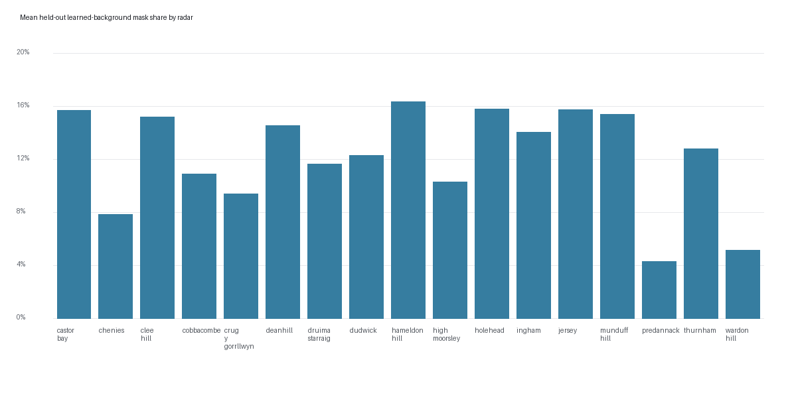

# Learned Background Validation: All Radars

Status: 17 radars completed; 0 failed.

| Radar | Date | Train scans | Hold-out scans | Mean masked | Hold-out range |
| --- | --- | ---: | ---: | ---: | --- |
| castor-bay | 20260703 | 60 | 20 | 15.73% | 15.66-15.77% |
| chenies | 20260703 | 60 | 20 | 7.89% | 7.87-7.90% |
| clee-hill | 20260703 | 60 | 20 | 15.23% | 15.22-15.23% |
| cobbacombe | 20260703 | 60 | 20 | 10.94% | 10.93-10.94% |
| crug-y-gorrllwyn | 20260703 | 60 | 20 | 9.42% | 9.40-9.42% |
| deanhill | 20260703 | 60 | 20 | 14.60% | 14.59-14.60% |
| druima-starraig | 20260703 | 60 | 20 | 11.67% | 11.62-11.68% |
| dudwick | 20260703 | 60 | 20 | 12.32% | 12.27-12.39% |
| hameldon-hill | 20260703 | 60 | 20 | 16.36% | 16.32-16.43% |
| high-moorsley | 20260703 | 60 | 20 | 10.32% | 10.07-10.50% |
| holehead | 20260703 | 60 | 20 | 15.85% | 15.52-16.16% |
| ingham | 20260703 | 60 | 20 | 14.07% | 14.04-14.11% |
| jersey | 20260703 | 60 | 20 | 15.77% | 15.62-15.92% |
| munduff-hill | 20260703 | 60 | 20 | 15.42% | 14.32-16.22% |
| predannack | 20260703 | 60 | 20 | 4.34% | 4.33-4.34% |
| thurnham | 20260703 | 60 | 20 | 12.81% | 12.77-12.84% |
| wardon-hill | 20260703 | 60 | 20 | 5.18% | 5.11-5.23% |

## Errors

None.
