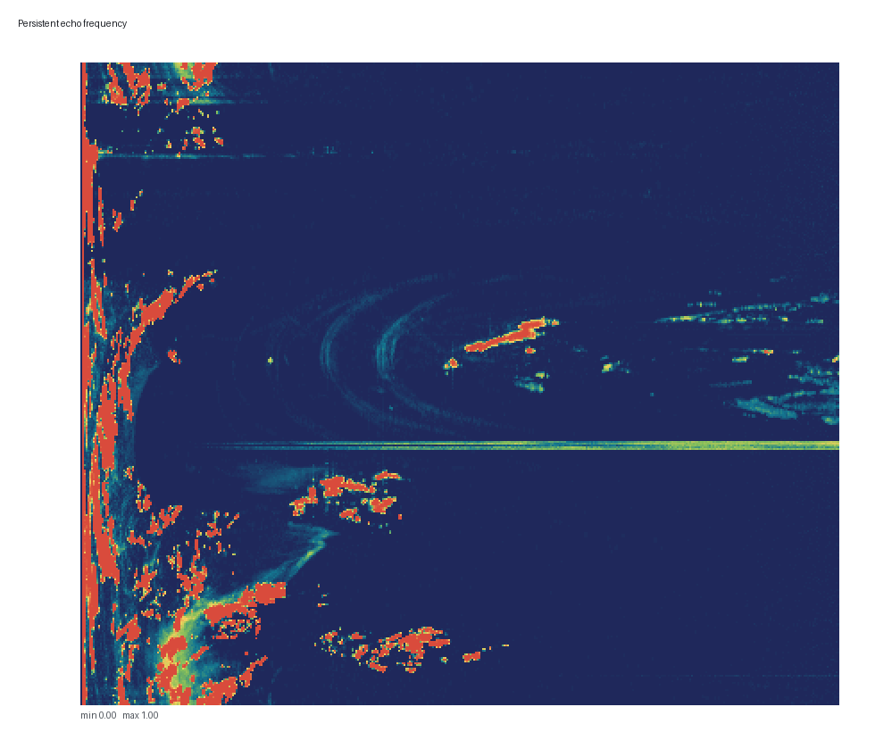
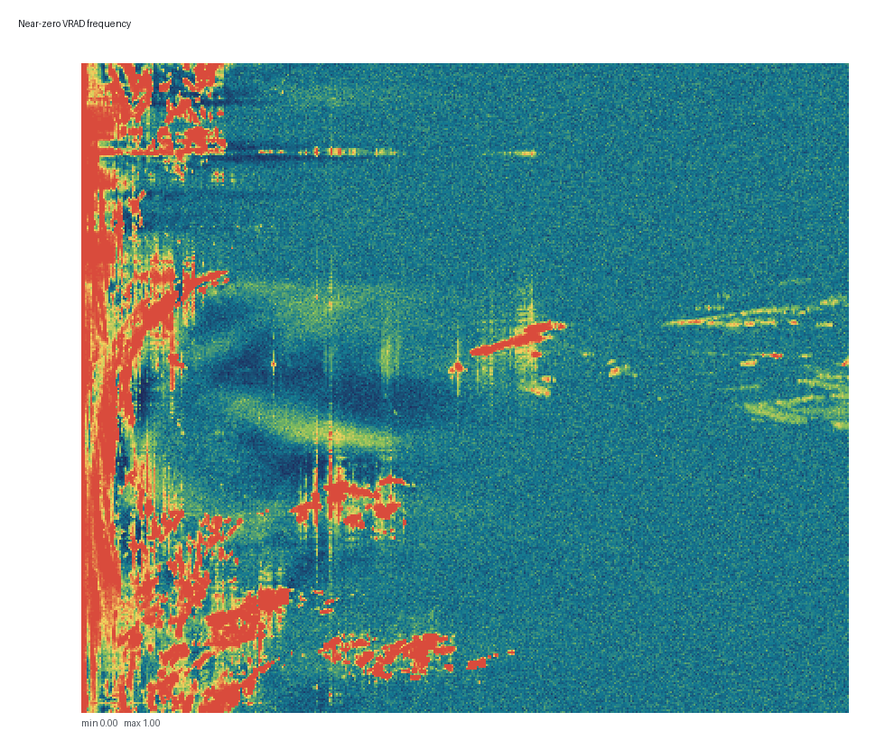
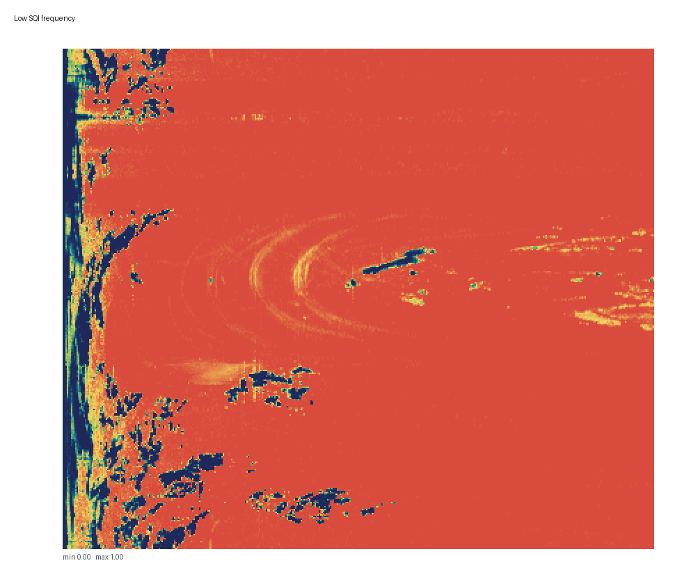
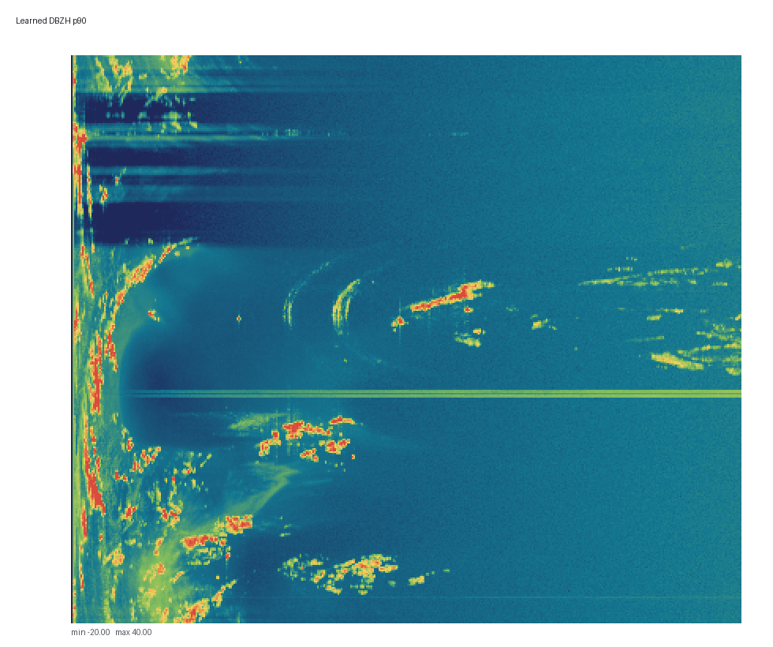
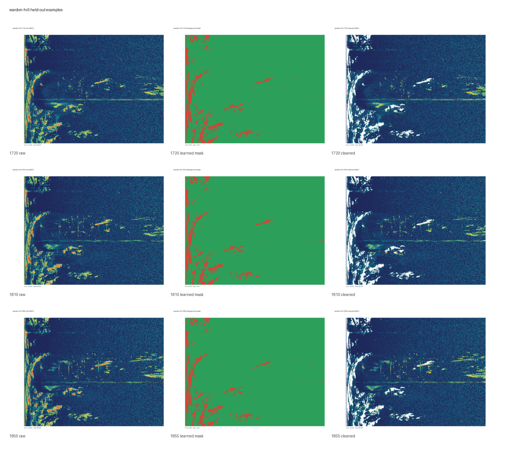
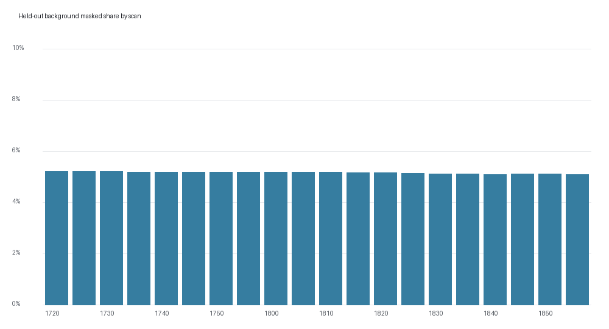

# Learned Background Validation: wardon-hill 20260703 lp DBZH dataset1

Status: real-data hold-out validation complete.

- Training: 60 real public PVOL/HDF5 scans (1210 to 1715)
- Hold-out validation: 20 scans (1720 to 1855)
- Model: `src/uk_wsr_visualizer/models/background/wardon-hill_lp_dbzh_dataset1_20260703.json`
- Shape: 360 azimuth rays x 425 range bins
- Mean held-out background-clutter mask share: 5.18%
- Range across hold-out scans: 5.11% to 5.23%

## Plots

## Artifacts

- Summary: `summary.json`
- Per-scan persisted masks: `masks/*.npz` plus `masks/*.npz.json`
- Each mask `.npz` contains `raw`, `cleaned`, and `mask`; `BACKGROUND_CLUTTER` is bit 1024.
