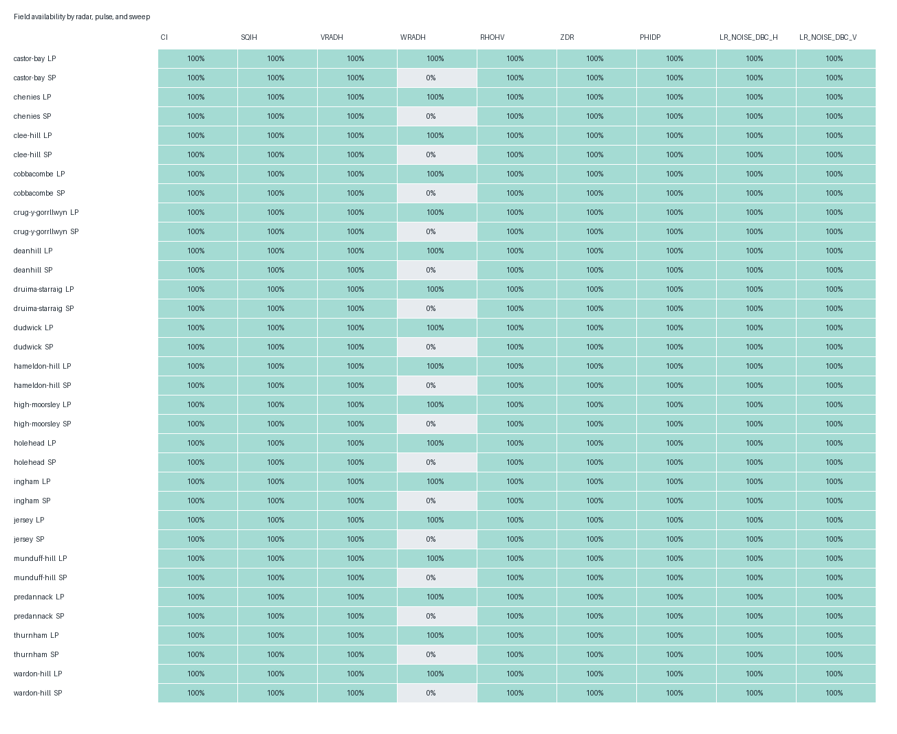
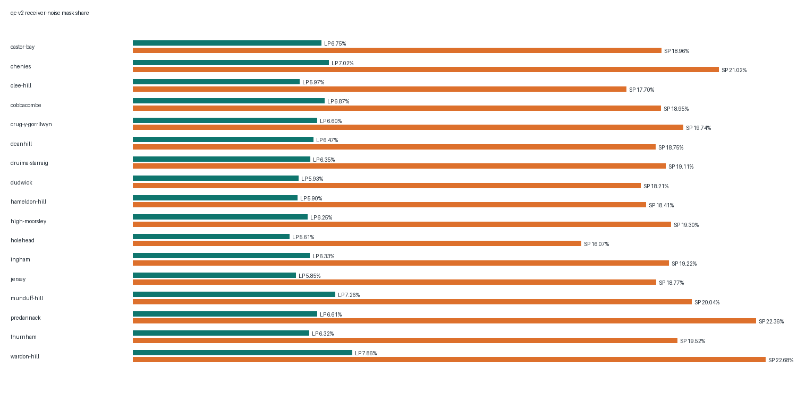
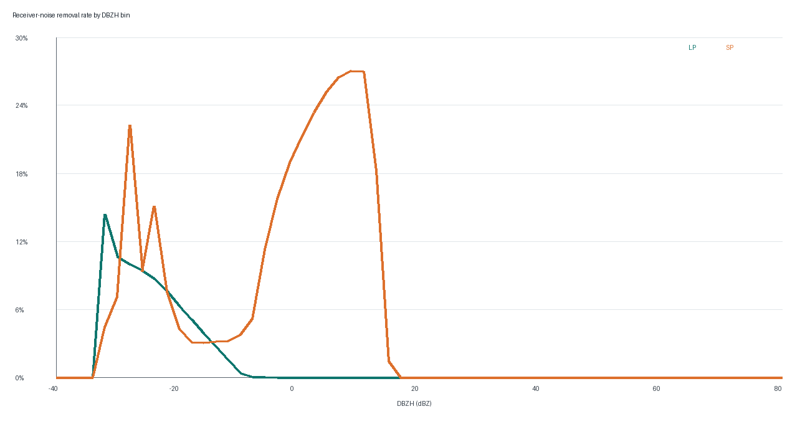
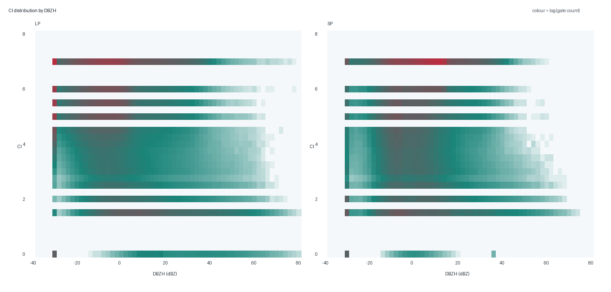
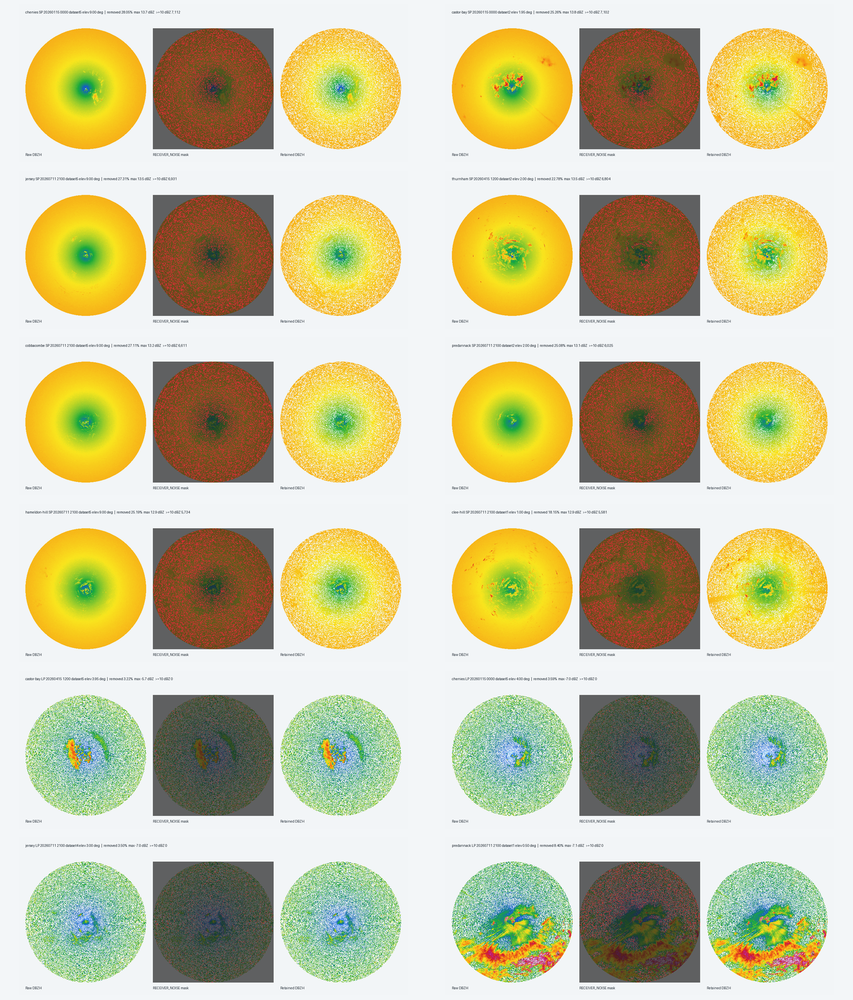

# UKMO WSR Field Semantics and qc-v2 Receiver-Noise Audit

Status: **real-data descriptive audit; not a labelled accuracy result.**

The sample contains 102 complete public
PVOL/HDF5 files from 17 radars and
561 DBZH sweeps. Each PVOL contributes all
elevations. Dates and times were selected from independent seasonal/day-night
anchors before inspecting field values.

## Immediate Findings

- LP receiver-noise mask share: 6.47%.
- SP receiver-noise mask share: 19.34%.
- Maximum LP DBZH removed: -5.7 dBZ.
- Maximum SP DBZH removed: 14.4 dBZ.
- Gates at or above 10 dBZ removed: LP 0, SP 1,103,169 (28.1% of SP removals).
- Gates at or above 20 dBZ removed: LP 0, SP 0.

The `RXnoiseH` and `RXnoiseV` attributes are reported as calibration metadata,
not as DBZH thresholds. `LONG_RANGE_NOISE_DBC_*` is audited separately because
its validity and scaling differ by pulse and radar. LP has finite receiver-noise
figures and plausible long-range-noise values. SP reports zero receiver-noise
figures and a constant -32 dBc long-range sentinel, so neither provides a
usable SP noise threshold.

CI is present on every audited sweep. Values at or above 6 occur on
66.6% of finite LP gates and
80.2% of finite SP gates.
That prevalence, plus the absence of a field-level definition in the source
files, means CI is evidence rather than a target label.

## Coverage and Mask Behaviour

| Radar | Pulse | Sweeps | CI | SQI | VRAD | Receiver noise removed | Maximum removed dBZ | Removed >=10 dBZ | Removed >=20 dBZ |
| --- | --- | ---: | ---: | ---: | ---: | ---: | ---: | ---: | ---: |
| castor-bay | LP | 15 | 100% | 100% | 100% | 6.75% | -5.7 | 0 | 0 |
| castor-bay | SP | 18 | 100% | 100% | 100% | 18.96% | 14.4 | 98302 | 0 |
| chenies | LP | 15 | 100% | 100% | 100% | 7.02% | -7.0 | 0 | 0 |
| chenies | SP | 18 | 100% | 100% | 100% | 21.02% | 14.0 | 86054 | 0 |
| clee-hill | LP | 15 | 100% | 100% | 100% | 5.97% | -8.1 | 0 | 0 |
| clee-hill | SP | 18 | 100% | 100% | 100% | 17.70% | 12.9 | 72934 | 0 |
| cobbacombe | LP | 15 | 100% | 100% | 100% | 6.87% | -7.4 | 0 | 0 |
| cobbacombe | SP | 18 | 100% | 100% | 100% | 18.95% | 13.5 | 68813 | 0 |
| crug-y-gorrllwyn | LP | 15 | 100% | 100% | 100% | 6.60% | -8.1 | 0 | 0 |
| crug-y-gorrllwyn | SP | 18 | 100% | 100% | 100% | 19.74% | 13.0 | 74036 | 0 |
| deanhill | LP | 15 | 100% | 100% | 100% | 6.47% | -8.9 | 0 | 0 |
| deanhill | SP | 18 | 100% | 100% | 100% | 18.75% | 11.9 | 43232 | 0 |
| druima-starraig | LP | 15 | 100% | 100% | 100% | 6.35% | -8.5 | 0 | 0 |
| druima-starraig | SP | 18 | 100% | 100% | 100% | 19.11% | 12.4 | 60810 | 0 |
| dudwick | LP | 15 | 100% | 100% | 100% | 5.93% | -7.3 | 0 | 0 |
| dudwick | SP | 18 | 100% | 100% | 100% | 18.21% | 12.3 | 54997 | 0 |
| hameldon-hill | LP | 15 | 100% | 100% | 100% | 5.90% | -7.4 | 0 | 0 |
| hameldon-hill | SP | 18 | 100% | 100% | 100% | 18.41% | 13.3 | 77469 | 0 |
| high-moorsley | LP | 15 | 100% | 100% | 100% | 6.25% | -8.8 | 0 | 0 |
| high-moorsley | SP | 18 | 100% | 100% | 100% | 19.30% | 11.7 | 40790 | 0 |
| holehead | LP | 15 | 100% | 100% | 100% | 5.61% | -8.4 | 0 | 0 |
| holehead | SP | 18 | 100% | 100% | 100% | 16.07% | 12.5 | 59172 | 0 |
| ingham | LP | 15 | 100% | 100% | 100% | 6.33% | -8.4 | 0 | 0 |
| ingham | SP | 18 | 100% | 100% | 100% | 19.22% | 12.3 | 57519 | 0 |
| jersey | LP | 15 | 100% | 100% | 100% | 5.85% | -7.0 | 0 | 0 |
| jersey | SP | 18 | 100% | 100% | 100% | 18.77% | 13.9 | 83954 | 0 |
| munduff-hill | LP | 15 | 100% | 100% | 100% | 7.26% | -7.5 | 0 | 0 |
| munduff-hill | SP | 18 | 100% | 100% | 100% | 20.04% | 12.5 | 62693 | 0 |
| predannack | LP | 15 | 100% | 100% | 100% | 6.61% | -7.1 | 0 | 0 |
| predannack | SP | 18 | 100% | 100% | 100% | 22.36% | 13.3 | 67187 | 0 |
| thurnham | LP | 15 | 100% | 100% | 100% | 6.32% | -7.3 | 0 | 0 |
| thurnham | SP | 18 | 100% | 100% | 100% | 19.52% | 13.6 | 95207 | 0 |
| wardon-hill | LP | 15 | 100% | 100% | 100% | 7.86% | -11.4 | 0 | 0 |
| wardon-hill | SP | 18 | 100% | 100% | 100% | 22.68% | 9.4 | 0 | 0 |

## Plots

## Before, Mask, and Retained Signal

The gallery shows the highest-risk sweep for each SP radar plus eight LP
comparators. Red gates are the exact `RECEIVER_NOISE` bit in the persisted
qc-v2 mask; the right panel is the retained field. Individual full-resolution
cases are in [`cases/`](cases/).

## Interpretation Limits

This report establishes field availability, scaling, correlations, and the
behaviour of the current conservative mask. It does not establish whether an
individual removed gate is truly receiver noise. That requires independently
labelled weather, biological, clutter, interference, and clear-air objects.
The report is therefore an input to the benchmark corpus, not permission to
increase removal.
